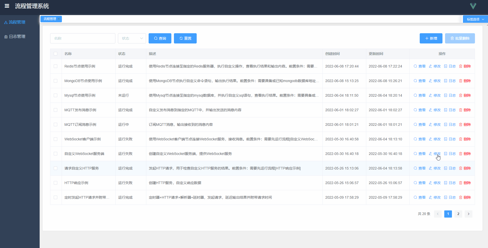
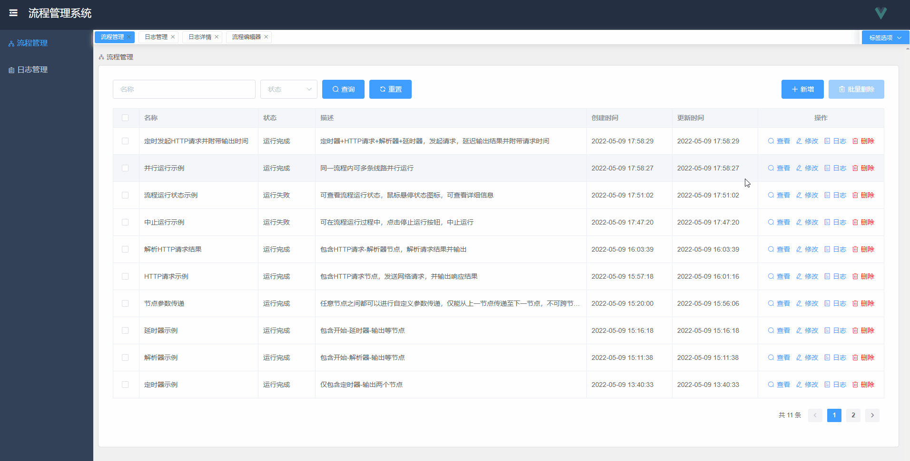
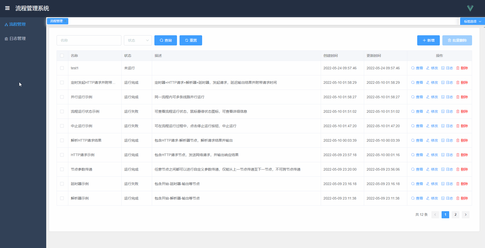
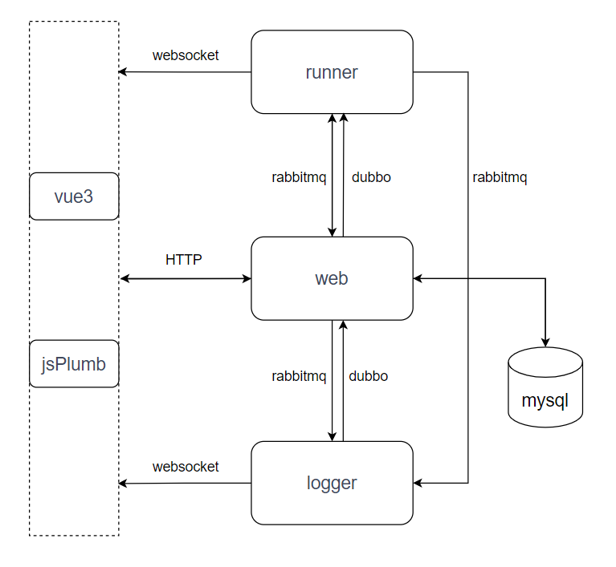

# flow-eda

### 介绍
一个由Java语言开发的基于事件驱动的流式低代码编程应用程序，您可以在编辑器中采用拖拽的形式来实现业务编程工作，一键部署，支持自定义组件和功能扩展。让开发和部署工作变得更简单高效。

欢迎各路大神共同参与开发，项目持续开发中，敬请期待...


项目名称介绍：
- flow: 流式编程
- eda: 事件驱动应用程序(Event Driven Application)


在线DEMO

作者本人自费租了云服务器，搭建了 [在线demo](http://36.138.228.74:90/#/flows)
开源不易，请珍惜服务器资源，感谢！



项目截图：







期待您的参与，项目持续开发中...


### 项目模块说明

1. flow-eda-common 公共工具模块
2. flow-eda-runner 流运行引擎模块
3. flow-eda-web    后台管理web模块
4. flow-eda-logger 日志管理模块
5. flow-eda-vue    前端vue模块
6. flow-eda-react  前端react模块


### 后端技术栈

- 部署：docker，版本20.10.14
- 部署：docker-compose，版本2.5.0
- 数据库：mysql，版本8.0.28
- 微服务框架：springboot，版本2.6.4
- 持久化框架：mybatis，版本2.2.2
- 代码插件：lombok，版本1.18.22
- 服务注册中心：nacos，版本2.0.4
- 服务远程调用：dubbo，版本3.0.7
- 数据推送：websocket，版本2.6.4
- 消息队列：rabbitmq，版本3.9.15


### 系统架构图




### 支持的功能节点

**基础**
- [x] start节点，是触发流程执行的起始节点
- [x] timer节点，定时器，定时触发流程，支持周期触发和cron表达式触发，可指定执行次数，可输出指定格式的时间戳
- [x] output节点，输出节点，用于输出上游节点传递下来的输出参数
- [x] delay节点，延时器，用于延迟指定时间后再执行其下游节点

**解析**
- [x] json解析器，用于解析上游节点的输出参数，获取用户需要的参数信息
- [ ] xml解析器，用于解析xml格式的数据，获取指定xml标签内的内容
- [ ] html解析器，用于解析html网页内容，获取指定内容数据

**网络**
- [x] HTTP请求节点，可发送HTTP请求，支持herder、token等请求头，支持url带参数，支持由上游节点输入的变量
- [ ] HTTP响应节点，可自定义http服务，指定http参数和响应内容，可动态响应数据
- [ ] websocket客户端，可用于连接websocket服务，发送和接收数据
- [ ] websocket服务端，创建一个websocket服务，可响应客户端的连接和数据的接收/发送
- [ ] TCP请求节点，可发送TCP请求，并接收响应数据
- [ ] TCP响应节点，创建一个TCP服务，可用于响应TCP客户端的请求

**数据库**
- [ ] mysql节点，可连接mysql数据库，执行自定义sql语句，输出查询结果
- [ ] mysql结果解析器，用于解析mysql数据库的查询结果，输出指定内容
- [ ] mongodb节点，可连接mongodb数据库，执行自定义查询语句，输出查询结果

持续开发中...


### 主要功能点

- 支持绘制任意的流程图，没有繁琐的约束，仅针对不同节点的参数做了校验
- 各节点地位平等，不分头尾，可任意连接绘制，连接数量无上限，仅对节点的功能做了区分
- 节点支持自定义参数，支持使用占位符${}获取参数值，由上至下可无限传递，可在任意位置取值
- 绘制流程图支持常用快捷键，可使用快捷键对节点进行操作
- 支持查看实时运行状态变化，可在页面上实时看到流程运行至哪一步，以及各节点当前的状态、错误信息等
- 查看实时运行日志功能，可在流程运行时查看日志，内含各个节点的输入输出参数
- 流程运行时，支持停止运行功能，可立即停止当前流程的运行
- 流程采用并行运行的方式，会自动从流程中找出所有起始节点开始并行运行，数据隔离，互不干扰
- 日志管理功能，采集了所有的运行日志和操作日志，用户可在页面上查看日志内容

更多功能，等着你发现！


### 项目部署

#### Docker 部署

部署mysql

```shell script
docker run --privileged=true -d -v /root/app/mysql/data/:/var/lib/mysql -v /root/app/mysql/conf.d:/etc/mysql/conf.d -v /root/app/mysql/my.cnf:/etc/mysql/my.cnf -p 3306:3306 --name mysql -e MYSQL_ROOT_PASSWORD=123456 mysql
```

部署rabbitmq

```shell script
docker run -d -p 5672:5672 -p 15672:15672 --name rabbitmq -v /root/app/rabbitmq/data:/var/lib/rabbitmq --restart=always rabbitmq
# 开启后台管理页面的插件（可选）
docker exec -it rabbitmq bash
rabbitmq-plugins enable rabbitmq_management
exit
```

部署nacos

```shell script
docker run -d -e MODE=standalone -e SPRING_DATASOURCE_PLATFORM=mysql -e MYSQL_SERVICE_HOST=10.0.4.17 -e MYSQL_SERVICE_USER=root -e MYSQL_SERVICE_PASSWORD=123456 -e MYSQL_SERVICE_DB_NAME=nacos_config -e JVM_XMS=256m -e JVM_XMX=256m -e JVM_XMN=256m -p 8848:8848 -p 9848:9848 -p 9849:9849 --privileged=true --name nacos --restart=always nacos/nacos-server
```

部署springboot应用

```shell script
# 打包镜像
sh build.sh
# 启动应用
sh start.sh
```


#### docker-compose 部署

```shell script
# 打包镜像
sh build.sh
# 创建容器，在`docker-compose.yml`文件路径下执行
docker-compose up -d
```


### 待开发项

- [ ] 功能节点待补充，目前暂时想不出来还需要哪些可能用到的功能节点，欢迎任何有想法的朋友提issue，我尽可能地扩展功能节点
- [ ] 由于流程是并行运行，而且非阻塞节点运行速度很快，这就导致使用websocket在同一个session下推送消息会报错，目前采用的是加锁的形式避免问题，后期考虑使用EMQX替代websocket进行消息推送
- [ ] 由于vue3和jsPlumb组件的限制，导致无法同时打开多个编辑页进行编辑流，目前是限制了仅能打开单个编辑页，后续考虑使用react重新写前端模块（正在开发中），支持多个流程同时编辑，互不干扰
- [ ] 新增oauth模块，用于鉴权认证，整个项目需要实现鉴权和数据隔离
- [ ] 由于部署在线demo云服务器的资源限制（穷！），本项目全部线上部署目前占用总内存4G左右，导致很多中间件引入进来后服务器资源不够部署，后期考虑等服务器资源足够后，引入redis做分布式缓存，将mysql进行读写分离，引入Prometheus+Grafana实现项目监控，采用k8s部署等一系列优化（等买的起新的服务器再说-.-）
