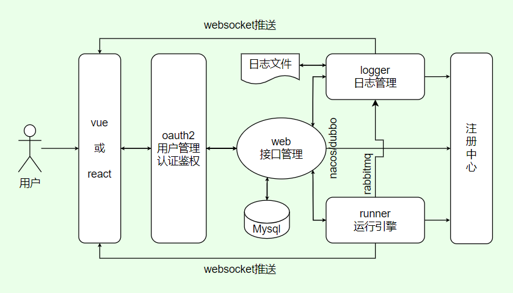
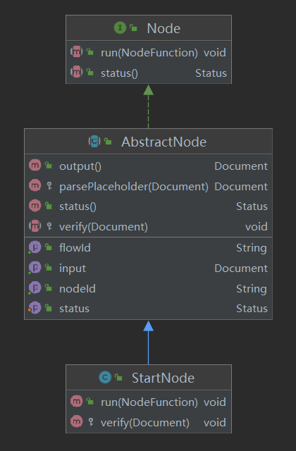

# 设计思想

本项目的主要设计思想是采用低代码可视化拖拽编程的方式来实现一些常用的业务逻辑。
用户可以通过拖拽连接一个个功能节点来组成流程图并运行，达到实现业务功能的目的。

### 项目交互流程

用户使用本项目平台的交互流程图：



通过上图可以很直观的看到用户与平台交互的整个运行过程，以及各个服务模块担任的功能职责。

- vue 和 react 为前端项目，部署后用户通过浏览器访问前端页面
- 用户登录/注册/登出等功能由 oauth2 服务提供
- 整个平台的所有接口服务等资源均由 oauth2 服务提供鉴权认证
- 用户访问平台的所有 API 接口均由 web 服务提供，用户的流程数据存储也是由 web 服务负责
- 流程运行时，由 web 服务调用 runner 服务运行流程，由 runner 服务负责执行流程的运行
- runner 服务在运行流程时会产生运行日志，通过 rabbitmq 发送到 logger 服务，同时通过 websocket 将运行信息推送到前端
- logger 服务负责收集和存储日志信息，同时也提供了查询日志的功能

### 功能节点模型设计

**1. 功能节点定义**

功能节点是将各个单独的功能逻辑封装起来的一种逻辑单元，每个功能节点都有它自己的功能属性，例如延时器节点可以延迟流程执行、输出节点可以输出参数内容等。
关于功能节点的详细定义和使用说明请查看[功能节点](getting-started/flow-node.md)。

功能节点是组成流程图的最小基本单元，一个流程图至少含有一个功能节点。将各个功能节点进行连接组合，再填写好节点参数，一个简单的流程图就绘制完成了。

**2. 对象模型设计**

功能节点的对象模型在 runner 服务中定义，主要用于流程运行时执行各个节点的逻辑功能。

在项目模块`flow-eda-runner`中，功能节点全都定义在`com.flow.eda.runner.node`包下面。我们定义了一个节点接口`Node`：

```java
public interface Node {
    /**
     * 运行当前节点实例
     *
     * @param callback 回调函数，当前节点执行完毕之后进行回调
     */
    void run(NodeFunction callback);

    /**
     * 获取当前节点的执行状态
     *
     * @return 节点状态，初始值为 Status.RUNNING
     */
    Status status();

    /** 节点的运行状态定义 */
    enum Status {
        /** 运行中 */
        RUNNING,
        /** 运行完成 */
        FINISHED,
        /** 运行失败 */
        FAILED
    }
}
```

还定义了一个节点抽象类`AbstractNode`，此类是`Node`接口的子类。

```java
/** 节点抽象类 */
public abstract class AbstractNode implements Node {
    /** 输入参数，由上个节点传递至此 */
    private final Document input;
    private final String flowId;
    private final String nodeId;
    /** 节点自定义参数，可传递至下个节点 */
    private Document payload;
    /** 节点当前的运行状态 */
    private Status status = Status.RUNNING;

    /**
     * 抽象类含参构造，用于约束子类必须有一个含参构造
     *
     * @param params 节点的输入参数，由上一个节点传递至此
     */
    public AbstractNode(Document params) {
        this.flowId = params.getString("flowId");
        this.nodeId = params.getString("nodeId");
        this.payload = params.get("payload", Document.class);
        this.input = params.get("input", Document.class);
        // 校验节点参数
        this.verify(params);
    }

    /** 节点参数校验 */
    protected abstract void verify(Document params);
}
```

项目规定所有的节点对象都必须继承此节点抽象类`AbstractNode`，便于统一运行和管理。我们以任一节点为例，查看它的依赖关系图：



由上图可以看出，每个功能节点都必须含有两个方法，其中`run`方法是节点接口的运行方法的实现，供外部调用。
`verify`方法是节点抽象类的抽象方法的实现，用于校验节点的参数。除此之外，每个功能节点都必须含有一个含参构造函数，用于将参数传递至父类抽象节点。

下面是一个最简单的节点代码示例：

```java
public class StartNode extends AbstractNode {

    public StartNode(Document params) {
        super(params);
    }

    @Override
    public void run(NodeFunction function) {
        // 设置节点运行状态为完成
        setStatus(Status.FINISHED);
        // 节点运行完之后进行回调
        function.callback(output());
    }

    @Override
    protected void verify(Document params) {}
}
```

规定所有的功能节点都必须按照这个模板的格式来开发，各节点可以在`verify`方法内校验并获取自己定义的个性化参数，在`run`方法内定义自己的运行逻辑。
这样统一规范有利于各节点的统一管理和运行，同时也便于各个节点的功能扩展和个性化开发。

### 节点运行设计

当我们开发好某个功能节点后，还需要在枚举`NodeTypeEnum`中配置该节点：

```java
public enum NodeTypeEnum {
    START("start", StartNode.class),
    OUTPUT("output", OutputNode.class),
    // ...
    ;
    private final String type;
    private final Class<? extends Node> clazz;
}
```

将我们开发的节点类型（标识）和对应的节点类配置到此枚举中，当需要运行某一节点时，可根据节点类型`type`直接获取到对应的节点类，
然后将入参传入构造函数，再通过反射，获取该节点的对象实例：

```java
public class FlowExecutor {
    /** 获取当前节点的实例 */
    private Node getInstance(FlowData currentNode) {
        try {
            Class<? extends Node> clazz = NodeTypeEnum.getClazzByNode(currentNode);
            return clazz.getConstructor(Document.class).newInstance(currentNode.getParams());
        } catch (Exception e) {
            throw FlowException.wrap(e);
        }
    }
}
```

获取到节点对象实例后，就可以调用该节点的`run`方法运行该节点了，同时在`run`方法的回调函数里接收该节点的输出参数。
这样，一个节点的运行，以及节点输入输出参数的设计处理就完成了。

### 流程运行设计

**1. 线程池管理工具**

各个流程的运行采用统一管理线程池的方式，给每个流程分配一个单独的线程池，保证各流程运行时的线程安全。
线程池管理工具`FlowThreadPool`内容如下：

```java
/** 用于执行整个流程的线程池管理工具，方便统一管理和约束线程池的创建/使用/销毁 */
public class FlowThreadPool {
    private static final Map<String, ExecutorService> POOL_MAP = new ConcurrentHashMap<>();

    public static ExecutorService getThreadPool(String flowId) {
        if (POOL_MAP.containsKey(flowId)) {
            return POOL_MAP.get(flowId);
        }
        ExecutorService threadPool = Executors.newCachedThreadPool();
        POOL_MAP.put(flowId, threadPool);
        return threadPool;
    }

    public static void shutdownThreadPool(String flowId) {
        if (POOL_MAP.containsKey(flowId)) {
            POOL_MAP.get(flowId).shutdownNow();
            POOL_MAP.remove(flowId);
        }
    }
}
```

可以看出，线程池管理工具提供了两个方法，获取线程池和关闭/销毁线程池，用于流程运行和停止运行，回收资源。
这样统一管理，可以避免造成内存泄露的风险，同时也便于统一管理和约束线程池的创建/使用/销毁。

**2. 流程运行设计**

一个流程的运行是由各个节点的单独运行连接起来的。当我们运行一个流程时，需要先找出流程中的起始节点，然后获取流程线程池，从起始节点开始，异步运行。

当流程开始运行后，先从起始节点开始，按照节点之间的连接顺序，依次向下运行，直至流程运行结束。
对于单条流程的运行我们也专门封装一个类来处理，`FlowExecutor`类内容如下：

```java
/** 单条流程的执行者 */
public class FlowExecutor {
    /** 存储当前流程的完整流程节点数据 */
    private final List<FlowData> flowData;
    /** 当前流程的id */
    private final String flowId;

    public FlowExecutor(List<FlowData> flowData) {
        this.flowData = flowData;
        this.flowId =
                Objects.requireNonNull(findFirst(flowData, n -> n.getFlowId() != null)).getFlowId();
    }

    /** 执行当前节点 */
    private void run(FlowData currentNode) {
        try {
            Node nodeInstance = getInstance(currentNode);
            // 运行节点
            nodeInstance.run(p -> this.runNext(currentNode, nodeInstance, p));
        } catch (Exception e) {
            throw FlowException.wrap(e);
        }
    }

    /** 执行下一节点 */
    private void runNext(FlowData currentNode, Node nodeInstance, Document p) {
        // 多个下游节点，需要并行执行
        List<FlowData> nextNodes = getNextNode(currentNode);
        forEach(nextNodes, n -> getThreadPool(flowId).execute(() -> this.run(setInput(n, p))));
    }

    /** 获取当前节点的下游节点 */
    private List<FlowData> getNextNode(FlowData currentNode) {
        List<String> ids =
                filterMap(flowData, n -> currentNode.getId().equals(n.getFrom()), FlowData::getTo);
        if (isNotEmpty(ids)) {
            return filter(flowData, n -> ids.contains(n.getId()));
        }
        return null;
    }

    /** 获取当前节点的实例 */
    private Node getInstance(FlowData currentNode) {
        try {
            Class<? extends Node> clazz = NodeTypeEnum.getClazzByNode(currentNode);
            return clazz.getConstructor(Document.class).newInstance(currentNode.getParams());
        } catch (Exception e) {
            throw FlowException.wrap(e);
        }
    }
}
```

通过上述代码可以看出，整个流程的运行逻辑，是从起始节点开始，依次运行节点。 每当一个节点运行结束时，会调用回调函数，继续运行它的下一个节点。

每当一个节点运行完成后，都会从当前流程的线程池中获取新的线程来继续运行下一节点。
若当前节点有多个下游节点，那么每个下游节点的运行都是一个单独的线程。
这样设计的目的是为了避免造成流程阻塞，保证了流程节点数据的线程安全，同时也是为了在多条下游支路的情况下能够同时运行。

### 流程状态更新

**1. 流程状态说明**

当用户在前端页面上开始运行一个流程后，前端就需要实时获取该流程的运行状态，以此来判断该展示运行按钮还是停止按钮。
总的来说，流程的状态分为两种：可运行、可停止。

实际上，针对不同的服务来说，流程状态略有差异。对于 runner 运行引擎，流程的运行状态分为 3 种：运行中、运行完成、运行失败；
对于 web 服务，流程状态分为：未运行、运行中、运行完成、运行失败。
web 服务多出来一个未运行的状态，这是由于用户新建了流程之后还未画流程图或从未运行过，故而使用未运行状态来标记该流程。
对于前端来说，除了运行中状态可停止流程，其余状态均可运行流程。

**2. 计算流程运行状态**

当一个流程开始运行时，我们就需要开始实时计算该流程的运行状态，并将其通过 websocket 推送至前端。
计算流程的运行状态服务我们写在 runner 运行引擎中，这是由于流程的运行状态是由多个节点运行状态决定的。
我们可以根据每个节点的运行状态更新来刷新流程运行状态，具体实现逻辑写在`FlowStatusService`类中。

```java
/** 流程状态服务，主要负责实时计算流程运行状态并监控其状态变更 */
@Service
public class FlowStatusService {
    /** 所有需要执行的节点 */
    private final Map<String, Set<String>> nodeMap = new ConcurrentHashMap<>();
    /** 正在运行的节点 */
    private final Map<String, Set<String>> runMap = new ConcurrentHashMap<>();

    public void startRun(String flowId, List<FlowData> data, List<FlowData> starts) {
        this.nodeMap.put(flowId, new ConcurrentHashSet<>());
        this.runMap.put(flowId, new ConcurrentHashSet<>());
        if (isNotEmpty(starts)) {
            this.parseAllNodes(flowId, data, starts);
        }
    }

    /** 实时计算流程状态 */
    public String getFlowStatus(String flowId, Document message) {
        String nodeId = message.getString("nodeId");
        String status = message.getString("status");
        if (Node.Status.FAILED.name().equals(status)) {
            nodeMap.get(flowId).remove(nodeId);
            runMap.get(flowId).remove(nodeId);
            return status;
        } else if (Node.Status.FINISHED.name().equals(status)) {
            nodeMap.get(flowId).remove(nodeId);
            runMap.get(flowId).remove(nodeId);
            if (nodeMap.get(flowId).isEmpty()) {
                return status;
            }
        } else {
            runMap.get(flowId).add(nodeId);
        }
        return Node.Status.RUNNING.name();
    }

    /** 解析出所有要执行的节点 */
    private void parseAllNodes(String flowId, List<FlowData> data, List<FlowData> starts) {
        forEach(
                starts,
                n -> {
                    this.nodeMap.get(flowId).add(n.getId());
                    parseNextNode(data, n, this.nodeMap.get(flowId));
                });
    }

    /** 解析出当前节点之后的所有节点 */
    private void parseNextNode(List<FlowData> data, FlowData currentNode, Set<String> nodeSet) {
        List<String> ids =
                filterMap(data, n -> currentNode.getId().equals(n.getFrom()), FlowData::getTo);
        if (isNotEmpty(ids)) {
            forEach(
                    filter(data, n -> ids.contains(n.getId())),
                    n -> {
                        nodeSet.add(n.getId());
                        parseNextNode(data, n, nodeSet);
                    });
        }
    }
}
```

通过代码我们可以看到，计算流程的实时运行状态并不复杂，通过节点的运行状态可很便捷的计算出流程的运行状态。

- 若节点运行失败，则当前流程状态为运行失败
- 若节点运行中，则当前流程状态为运行中
- 若节点运行完成，检查发现还有待运行的节点，则当前流程状态为运行中
- 若节点运行完成，检查待运行的节点为空（所有节点都运行完了），则当前流程状态为运行完成

在运行引擎中，每当一个节点的运行状态更新时，都会向前端推送一条 websocket 消息，
消息内容包含了当前节点的最新状态信息（若当前节点发生异常，则也会包含异常信息），我们在每次推送消息前，调用一下上述代码的`getFlowStatus`方法，
即可实时获取当前流程的运行状态，可合并到消息内容中一并推送至前端，这样就实现了向前端推送流程实时运行状态的功能。

**3. 流程状态同步**

我们知道流程在运行之后，会将流程运行状态实时推送到前端，由前端进行处理展示。
那如果前端页面关闭了呢？还有 web 服务获取流程数据时，数据库中的流程状态要如何保证正确性？这些问题都可以通过同步流程状态来解决。

我们在每个节点的运行状态更新时，会实时计算一次当前流程的运行状态，在我们向前端推送节点状态信息时，会同时向 RabbitMQ 中发送消息。

```java
public class FlowNodeWebsocket {
    /** 推送节点状态信息 */
    public void sendMessage(String flowId, Document message) {
        // 获取流程实时状态信息一起推送
        String flowStatus = flowStatusService.getFlowStatus(flowId, message);
        message.append("flowStatus", flowStatus);
        // 向前端推送节点状态信息
        if (SESSION_POOL.get(flowId) != null) {
            try {
                synchronized (SESSION_POOL.get(flowId)) {
                    SESSION_POOL.get(flowId).getBasicRemote().sendText(message.toJson());
                }
            } catch (Exception e) {
                log.error("Send websocket message failed:{}", e.getMessage());
            }
        }
        // 向RabbitMQ中推送流程的实时运行状态信息
        try {
            Document payload = new Document("flowId", flowId).append("status", flowStatus);
            rabbitTemplate.convertAndSend(EXCHANGE, ROUTING_KEY, payload);
        } catch (Exception e) {
            log.error("send flow status to rabbitmq failed:{}", e.getMessage());
        }
    }
}
```

这样一来，每次节点运行状态更新时，都会将状态信息推送到 RabbitMQ 中，保证了状态同步的消息投递。那么我们还需要在 web 服务里接收并处理这些消息。
