# 扩展开发

本项目后端采用了微服务、模块化、配置化的设计方式，便于二次开发和功能扩展；
前端采用了轻量化、模板化的设计方式，能够自动兼容新增的扩展功能。
在基于本项目做二次开发和功能扩展时，几乎不需要改动已有代码，仅添加新增的功能代码即可，极大的方便了扩展开发。

由于本项目作为流程管理系统，其最核心的组件就是功能节点。当本项目已有的功能节点无法满足你的业务需求时，我们就可以通过新增功能节点来满足需求。

> 同理，我们也可以对已有的功能节点做修改、删除等操作来满足自己的业务需求。

本项目针对新增功能节点预留了极大的扩展空间，您可以很灵活便捷地来扩展功能节点。下面将通过一个案例来介绍新增节点的详细过程。

### 新增节点案例

想要新增一个功能节点，首先你得明确该功能节点的需求（功能），其次，需要确定该节点的属性参数、是否必填等。

下面我们以一个简单的案例来介绍新增功能节点的整个过程，案例需求：

- 主要功能：对指定数组中的数字进行排序，支持顺序和倒序，节点名称为“排序”
- 节点参数：定义了两个节点参数，分别为：字段名（必填，用于取哪个字段的值）、排序（默认顺序）（选填，单选框，选项有顺序/倒序）

### 新增节点类

以上述案例为例，我们需要新增一个“排序”节点，在`flow-eda-runner`项目的包`com.flow.eda.runner.node`路径下新增一个`sort`包，
在该包下新增`SortNode`类：

```java
package com.flow.eda.runner.node.sort;

import com.flow.eda.runner.node.AbstractNode;
import com.flow.eda.runner.node.NodeFunction;
import org.bson.Document;

public class SortNode extends AbstractNode {

    public SortNode(Document params) {
        super(params);
    }

    @Override
    public void run(NodeFunction callback) {

    }

    @Override
    protected void verify(Document params) {

    }
}
```

根据案例需求，该节点有两个参数，我们分别定义为`field`和`order`，然后需要在`verify`方法内对这两个节点参数作校验和取值。
校验完参数后，我们将节点的功能（排序）逻辑写在`run`方法中，排好序之后，需要进行回调，将结果输出。

我们写好之后的完整代码如下：

```java
package com.flow.eda.runner.node.sort;

import com.flow.eda.runner.node.AbstractNode;
import com.flow.eda.runner.node.NodeFunction;
import com.flow.eda.runner.node.NodeVerify;
import com.flow.eda.runner.utils.PlaceholderUtil;
import org.bson.Document;

import java.util.Arrays;
import java.util.List;

public class SortNode extends AbstractNode {
    /** 字段名 */
    private String field;
    /** 排序（默认顺序） */
    private String order;
    /** 数组（字段值） */
    private List<Integer> array;

    public SortNode(Document params) {
        super(params);
    }

    @Override
    public void run(NodeFunction callback) {
        // 对数组进行排序
        if ("倒序".equals(this.order)) {
            this.array.sort((x, y) -> Integer.compare(y, x));
        } else {
            // 默认顺序
            this.array.sort(Integer::compareTo);
        }

        // 节点运行完成
        setStatus(Status.FINISHED);

        // 调用回调函数，输出结果
        callback.callback(new Document("result", this.array));
    }

    @Override
    protected void verify(Document params) {
        // 获取字段名
        this.field = params.getString("field");
        // 校验该字段不能为空（必填项）
        NodeVerify.notNull(this.field, "field");

        // 获取排序方式（选填）
        this.order = params.getString("order");

        // 校验输入参数不能为空
        NodeVerify.isTrue(!getInput().isEmpty(), "input");
        // 从输出参数中获取指定字段值
        Document res = PlaceholderUtil.parse(getInput(), Arrays.asList(this.field));

        // 校验指定字段值类型必须为数组
        Object result = res.get(this.field);
        NodeVerify.notNull(result, "field");
        NodeVerify.isTrue(result instanceof List, "field");

        // 将数组转化为数字数组，赋值
        try {
            this.array = (List<Integer>) result;
        } catch (Exception e) {
            NodeVerify.throwWithName("field");
        }
    }
}
```

### 新增节点单元测试

当我们开发好功能节点代码之后，需要新增对应的节点单元测试，用来测试其节点功能的正确性。

在节点类名上按编辑器的提示快捷键，为该节点类创建单元测试 Test

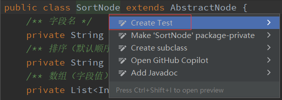
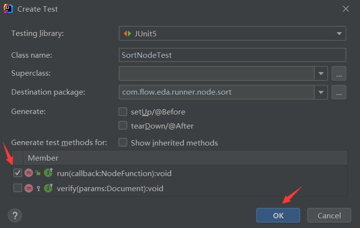

在节点单元测试类中给定测试数据，运行该节点，然后使用断言来判断节点运行结果是否与预期值一致。

> 注意：上一个节点的输出参数作为本节点的输入参数，我们在单元测试中需要用`input`字段来模拟。

```java
class SortNodeTest {

    @Test
    void run() {
        // 定义无序数组
        List<Integer> array = Arrays.asList(8, 3, 1, 2, 9, 4, 7, 6, 5);
        // 定义节点输入参数
        Document input = new Document("n", array);

        // 测试顺序
        Document params = new Document("field", "n").append("input", input);
        Node node = new SortNode(params);
        node.run(p -> Assertions.assertEquals(
                                p.get("result"), Arrays.asList(1, 2, 3, 4, 5, 6, 7, 8, 9)));

        // 测试倒序
        Document params1 = new Document("field", "n").append("order", "倒序").append("input", input);
        Node node1 = new SortNode(params1);
        node1.run(p -> Assertions.assertEquals(
                                p.get("result"), Arrays.asList(9, 8, 7, 6, 5, 4, 3, 2, 1)));
    }
}
```

运行该单元测试，测试通过，则表示该节点功能正常。

> 节点业务复杂的情况下，我们需要在单元测试中模拟不同场景的边界值来测试该节点在极端情况下的运行是否正常

### 新增节点数据配置

当我们开发完一个功能节点后，我们需要对这个节点进行一些数据配置。

**1. 配置节点类型枚举**

在节点类型枚举类`com.flow.eda.runner.node.NodeTypeEnum`中，我们需要将新增的节点配置上去

```java
public enum NodeTypeEnum {

    START("start", StartNode.class),
    OUTPUT("output", OutputNode.class),
    // ...

    SORT("sort", SortNode.class),
    // ...
    ;
}
```

**2. 数据库配置节点类型**

我们需要在数据库`flow_eda`中，在表`eda_flow_node_type`中新增一条节点数据配置。

根据你所定义的节点功能，选择一个合适的类别，例如我们案例中的“排序”节点，就可以归类到“运算”类别中，我们在运行类别中新增一条节点数据

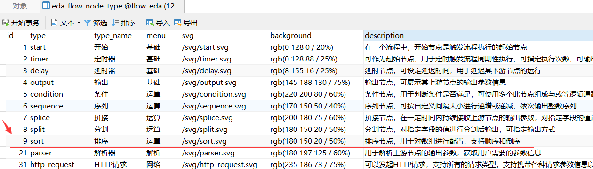

其中，`menu`字段为节点菜单类别，`svg`字段为节点图标，`background`字段为节点背景色，`description`字段为该节点前端鼠标悬浮展示的节点描述内容。

**3. 数据库配置节点参数**

我们需要在数据库`flow_eda`中，在表`eda_flow_node_type_param`中对应新增该节点的参数配置。

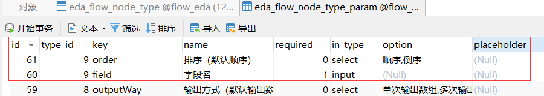

其中，`type_id`字段是表`eda_flow_node_type`中节点对应的`id`字段，`required`字段表示是否为必填项，
`in_type`字段表示页面上为输入框还是下拉选择框，`option`字段为下拉选项，以半角逗号分隔。
各个表字段在表结构描述中都有写注释，可自行查看。

### 新增节点图标和背景色

当我们完成了一个节点的代码开发和数据配置之后，想要在前端展示并正常使用，就需要给这个节点配置图标和背景色。

**1. 节点图标**

打开[iconfont 首页](https://www.iconfont.cn/)，搜索对应图标

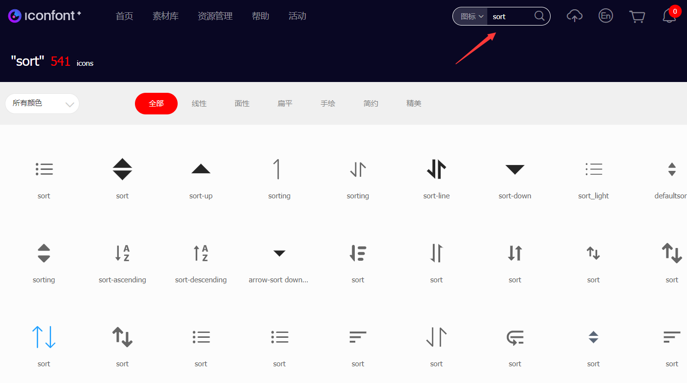

选取你心仪的图标，点击下载


然后选择合适的填充色，选择像素为 32，点击复制 SVG 代码。

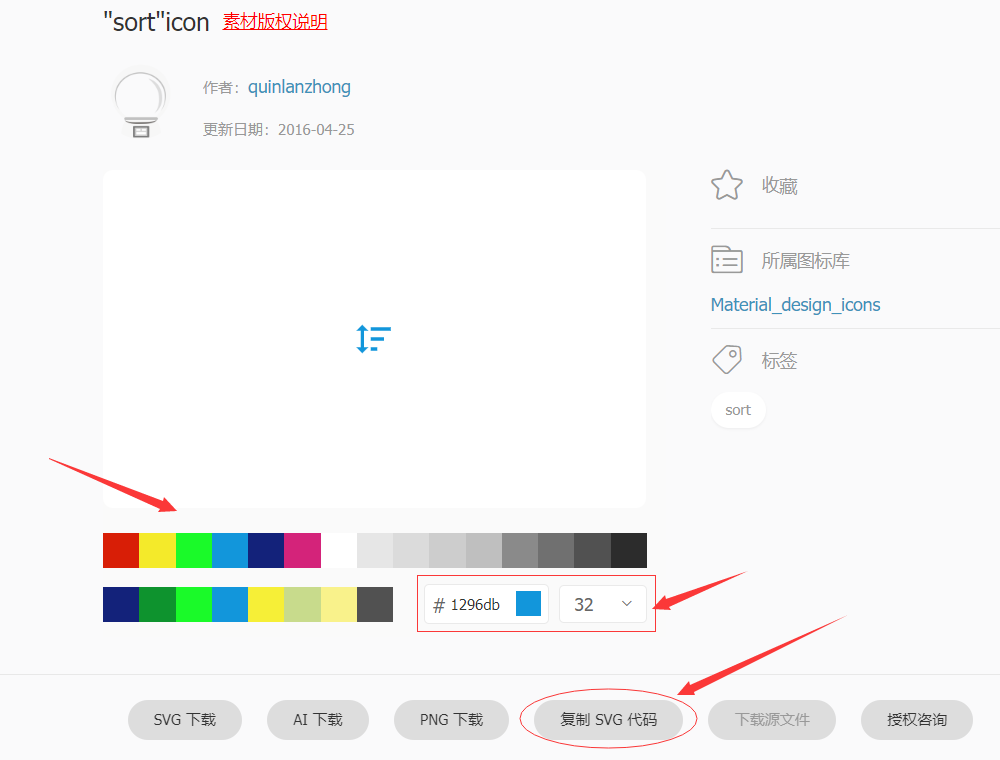

在前端项目的`public/svg`目录下，新增一个`sort.svg`文件，将刚复制的 SVG 内容粘贴到文件中。然后[本地启动项目](advanced/local-start.md)，
打开浏览器访问`localhost:8080`。我们新建一个测试流程，打开流程编辑器，查看刚刚新增的节点。

> vue 项目默认端口是`8080`，react 项目默认端口是`8000`。

**2. 节点背景色**

进入流程编辑器，找到我们新增的节点，查看并调整它的背景色。按`F12`打开网页调试工具，选择我们新增的节点。

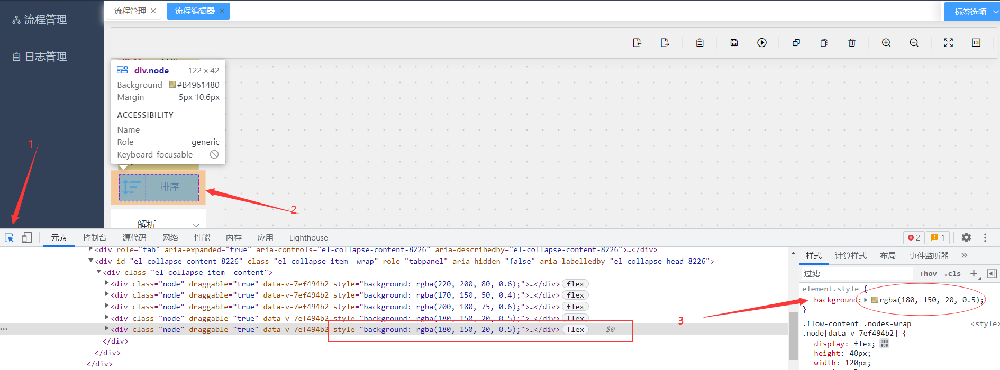

在右侧的“样式”栏中，点击 rgb 色块，选择合适的颜色，一边调整一边查看节点的表象，直至选择好背景色。建议和其他节点能够区分开即可。

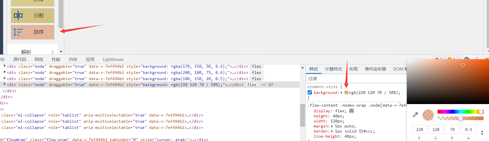

确定了节点背景色之后，需要将右侧的“样式”栏中的`background`属性的值复制出来，这里我的值是`rgb(220 120 70 / 50%)`。
然后将此值配置到表`eda_flow_node_type`中本节点数据对应的`background`字段即可。

至此，我们新增节点的流程就结束了，鼠标悬浮到节点上，可以查看节点的描述信息，拖拽一个节点，查看它的节点参数信息


### 运行节点

新增节点完成之后，我们需要画个简单的流程图，测试一下它的功能是否正常。

我们拖拽 3 个节点，开始--排序--输出，填写节点参数，然后运行此流程，查看输出结果。

> 多测试几组边界值来验证其功能的完整性

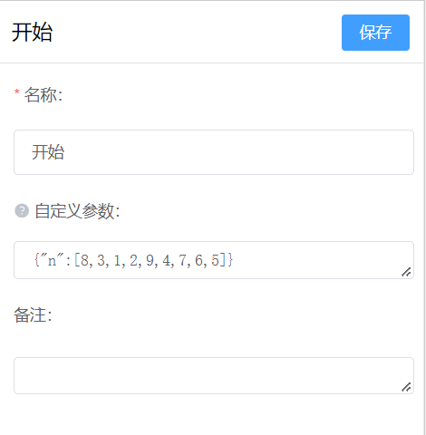
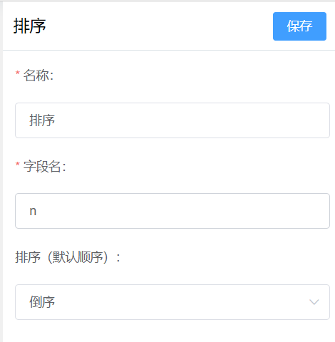

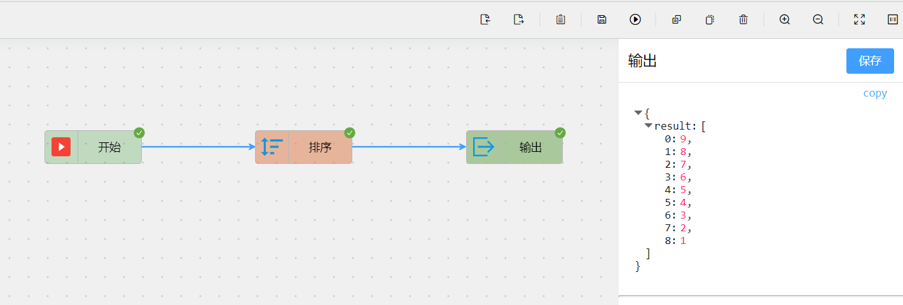

至此，我们新增的功能节点就可以投入正常使用了。
