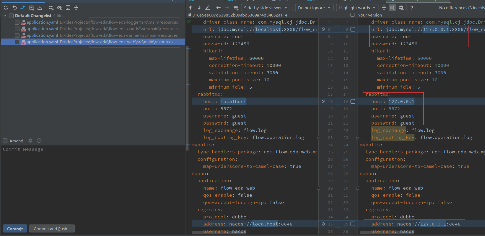
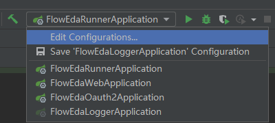

# 本地启动项目

本地启动项目，需要先拉取项目源码，进行本地构建，然后需要安装项目所依赖的一些中间件服务，修改配置文件。

### 安装中间件服务

本项目依赖的中间件服务有`Mysql`、`RabbitMQ`、`Nacos`，无论是服务器上安装还是本机安装都可以，只要这些中间件服务能够正常连接使用即可。

> 考虑到广大开发者朋友们的本地调试便捷性，可以切换到分支 feign-replace-dubbo，
> 该分支使用了 Feign 代替 Dubbo 的技术方案，可以不用安装 Nacos 服务，方便本地运行和调试。
> 有条件的情况下还是推荐使用 master 分支，安装 Nacos 服务作为注册中心。

由于网上资料比较丰富且详细，这里不再赘述，下面提供了几个博客可供参考：

- [Windows 安装 Mysql](https://blog.csdn.net/weixin_43423484/article/details/124408565)
- [Windows 安装 RabbitMQ](https://blog.csdn.net/qq_25919879/article/details/113055350)
- [Windows 安装 Nacos](https://blog.csdn.net/qq_43518425/article/details/124577232)
- [Linux 安装 RabbitMQ](https://blog.csdn.net/Lin_xiaofeng/article/details/87857536)
- [Linux 安装 Mysql](https://blog.csdn.net/Lin_xiaofeng/article/details/87628833)
- [Linux 安装 Nacos](https://blog.csdn.net/Mr_7777777/article/details/123133036)

另外，本项目文档提供了 docker 部署中间件的详细过程，可供参考：

- [docker 部署](deploy/docker.md)
- [docker-compose 部署](deploy/docker-compose.md)

### 本地构建项目

我们需要将项目的源码拉取到本地，可根据自身网络情况选择 Github 还是 Gitee 平台拉取代码。

```shell
# 从Github上拉取项目源码
git clone https://github.com/Linxfeng/flow-eda

# 从Gitee上拉取项目源码
git clone https://gitee.com/Linxff/flow-eda
```

源码拉取下来之后，使用你常用的编辑器打开项目源码，这里我们使用 IDEA 作为演示，其他编辑器类似。

使用我们的编辑器 IDEA 打开项目，配置 JDK，推荐使用 java8 或以上，使用`maven`构建项目，耐心等待项目构建完毕。

对于前端项目，推荐也使用 IDEA 构建，当然你使用 VS 或其他编辑器都是可以的。
下面我们用`flow-eda-vue`前端项目举例，对于`flow-eda-react`前端项目也是一样的，不再赘述。

打开我们编辑器的`Terminal`，进入前端项目目录下，执行`npm install`初始化安装前端项目依赖。

```shell
cd flow-eda-vue
npm install
```

等待前端项目依赖安装完毕，后端项目构建好之后，项目的本地构建就完成了。

### 本地启动项目

当项目构建完成之后，我们在启动项目前，还需要修改项目的配置文件，将我们安装好的中间件服务的 IP 地址或域名填写到后端项目的配置文件中。

例如：我们已经部署好了`Mysql`、`RabbitMQ`、`Nacos`等中间件服务，假设我们将这些服务都部署在同一台服务器上，我们假设服务器 IP 地址为`127.0.0.1`。
那么我们需要在后端项目的配置文件中修改对应内容，将`localhost`修改为`127.0.0.1`，同时检查项目配置中的用户名密码等，进行对应修改。

> 如果中间件服务部署在本机，那么本地启动项目则不需修改配置文件，直接使用`localhost`即可。



修改好配置文件后，我们就可以本地启用项目了。

后端项目在 IDEA 中直接启动即可

> 注意：`flow-eda-oauth2`服务必须启动，所有后端服务都依赖它进行鉴权认证，前端也依赖它进行登陆注册。



前端项目打开编辑器的`Terminal`，进入对应目录下，执行命令即可本地启动

```shell
# 对于flow-eda-vue项目
cd flow-eda-vue
npm run dev

# 对于flow-eda-react项目
cd flow-eda-react
npm start
```

前后端项目都启动好之后，就可以打开浏览器输入`localhost:端口`进行访问了，vue 项目默认端口是`8080`，react 项目默认端口是`8000`。
