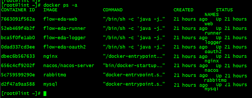

# Docker-Compose 部署

docker-compose 部署与 docker 部署略有不同，docker-compose 部署是采用一个 yaml 文件统一配置管理的方式，同时部署多个 docker 容器，简单快捷方便。

> 本项目部署的所有服务都在`/root/app/`目录下，你也可以对应修改为你自己的目录。

### 创建 docker-compose.yml 文件

我们在`/root/app/`目录下创建一个`docker-compose`目录，在 docker-compose 目录下创建`docker-compose.yml`文件，在该 yaml 文件里配置所有的服务，这样就可以方便的部署了。

`docker-compose.yml`文件内容：

```yaml
version: "3.9"

services:
  mysql:
    image: mysql
    container_name: mysql
    environment:
      MYSQL_ROOT_PASSWORD: 123456
    ports:
      - "3306:3306"
    volumes:
      - /root/app/mysql/data/:/var/lib/mysql
      - /root/app/mysql/conf.d:/etc/mysql/conf.d
      - /root/app/mysql/my.cnf:/etc/mysql/my.cnf
  rabbitmq:
    image: rabbitmq
    container_name: rabbitmq
    ports:
      - "5672:5672"
      - "15672:15672"
    volumes:
      - /root/app/rabbitmq/data:/var/lib/rabbitmq
  nacos:
    image: nacos/nacos-server
    container_name: nacos
    depends_on:
      - mysql
    ports:
      - "8848:8848"
      - "9848:9848"
      - "9849:9849"
    environment:
      MODE: standalone
      SPRING_DATASOURCE_PLATFORM: mysql
      MYSQL_SERVICE_HOST: mysql
      MYSQL_SERVICE_USER: root
      MYSQL_SERVICE_PASSWORD: 123456
      MYSQL_SERVICE_DB_NAME: nacos_config
      JVM_XMS: 256m
      JVM_XMX: 256m
      JVM_XMN: 256m
  nginx:
    image: nginx
    container_name: nginx
    network_mode: host
    volumes:
      - /root/app/nginx/www:/www
      - /root/app/nginx/conf/nginx.conf:/etc/nginx/nginx.conf
      - /root/app/nginx/conf/conf.d/default.conf:/etc/nginx/conf.d/default.conf
      - /root/app/nginx/logs:/wwwlogs
  oauth2:
    image: flow-eda-oauth2
    container_name: oauth2
    network_mode: host
  logger:
    image: flow-eda-logger
    container_name: logger
    network_mode: host
    volumes:
      - /root/app/springboot/logger/logs:/logs
  runner:
    image: flow-eda-runner
    container_name: runner
    network_mode: host
  web:
    image: flow-eda-web
    container_name: web
    network_mode: host
```

该 yaml 配置文件中定义了很多服务，你也可按需填写或修改，仅部署一些你需要的服务。

> 本项目提供了无注册中心部署，可以切换到项目分支 feign-replace-dubbo 进行打包部署，则不需要部署 nacos 服务。
> 有条件的情况下还是推荐使用 master 分支，部署 nacos 服务。

我们注意到 yaml 配置中有很多服务都挂载了一些外部目录或配置文件，我们需要创建这些挂载的目录或文件，来达到配置应用的效果。

### 创建应用挂载文件

#### Mysql

```shell
cd /root/app
mkdir mysql
cd mysql
mkdir data
mkdir conf.d
touch my.cnf
```

其中，`my.cnf`文件用于配置数据库，其内容为：

```shell
[mysqld]
user=mysql
character-set-server=utf8
default_authentication_plugin=mysql_native_password
authentication_policy= mysql_native_password
secure_file_priv=/var/lib/mysql
expire_logs_days=7
sql_mode=STRICT_TRANS_TABLES,NO_ZERO_IN_DATE,NO_ZERO_DATE,ERROR_FOR_DIVISION_BY_ZERO,NO_ENGINE_SUBSTITUTION
max_connections=1000
secure_file_priv=/var/lib/mysql
skip-name-resolve=1

[client]
default-character-set=utf8

[mysql]
default-character-set=utf8
default-time-zone='+8:00'
```

#### RabbitMQ

```shell
cd /root/app
mkdir rabbitmq
cd rabbitmq
mkdir data
```

#### 后端应用

```shell
cd /root/app
mkdir springboot
cd springboot
mkdir logger
cd logger
mkdir logs
```

#### Nginx

```shell
cd /root/app
mkdir nginx
cd nginx
mkdir conf
mkdir logs
mkdir www

cd conf
touch nginx.conf
mkdir conf.d
cd conf.d
touch default.conf
```

其中，`nginx.conf`文件内容为：

```shell
user root;
worker_processes auto;
error_log  /var/log/nginx/error.log notice;
pid        /var/run/nginx.pid;
events {
    worker_connections  1024;
}
http {
    include       /etc/nginx/mime.types;
    default_type  application/octet-stream;
    log_format  main  '$remote_addr - $remote_user [$time_local] "$request" '
                      '$status $body_bytes_sent "$http_referer" '
                      '"$http_user_agent" "$http_x_forwarded_for"';
    access_log  /var/log/nginx/access.log  main;
    sendfile        on;
    #tcp_nopush     on;
    keepalive_timeout  65;
    #gzip  on;
    include /etc/nginx/conf.d/*.conf;
}
```

`default.conf`文件内容为：

```shell
server {
    listen       80;
    listen  [::]:80;
    server_name  localhost;
    location / {
        root   /www/vue;
        index  index.html index.htm;
    }
    location /api/ {
        proxy_pass http://192.168.0.4:8081;
        proxy_set_header Host $http_host;
        proxy_set_header X-Real-IP $remote_addr;
        proxy_set_header X-Forwarded-For $proxy_add_x_forwarded_for;
        proxy_set_header REMOTE-HOST $remote_addr;
        proxy_set_header X-NginX-Proxy true;
        proxy_redirect   default;
    }
    location /oauth/ {
        proxy_pass http://192.168.0.4:8086;
        proxy_set_header Host $http_host;
        proxy_set_header X-Real-IP $remote_addr;
        proxy_set_header X-Forwarded-For $proxy_add_x_forwarded_for;
        proxy_set_header REMOTE-HOST $remote_addr;
        proxy_set_header X-NginX-Proxy true;
        proxy_redirect   default;
    }
}

server {
    listen       90;
    listen  [::]:90;
    server_name  localhost;
    location / {
        root   /www/react;
        index  index.html index.htm;
    }
    location /api/ {
        proxy_pass http://192.168.0.4:8081;
        proxy_set_header Host $http_host;
        proxy_set_header X-Real-IP $remote_addr;
        proxy_set_header X-Forwarded-For $proxy_add_x_forwarded_for;
        proxy_set_header REMOTE-HOST $remote_addr;
        proxy_set_header X-NginX-Proxy true;
        proxy_redirect   default;
    }
    location /oauth/ {
        proxy_pass http://192.168.0.4:8086;
        proxy_set_header Host $http_host;
        proxy_set_header X-Real-IP $remote_addr;
        proxy_set_header X-Forwarded-For $proxy_add_x_forwarded_for;
        proxy_set_header REMOTE-HOST $remote_addr;
        proxy_set_header X-NginX-Proxy true;
        proxy_redirect   default;
    }
}
```

上述 nginx 配置中，`default.conf`文件配置了两个 server，分别监听 80 端口和 90 端口，分别对应了 vue 和 react 项目。
若部署时只需要部署单个前端项目，则仅需要配置 80 端口即可。

> 注意修改`default.conf`配置中的 proxy_pass 项为你的后端项目 IP 地址，若前后端项目部署在同一台服务器上，则可以为内网 IP。

### 部署项目

创建好上述所有配置文件后，我们就可以开始部署项目了。

1. **上传项目包**

先将项目包上传至服务器，项目包来源详见[项目打包](deploy/packaging.md)。

将后端项目打好的 jar 包上传至`/root/app/springboot`目录下，将其[打包 Dokcer 镜像](deploy/docker?id=打包-docker-镜像)。
然后将前端项目打好的包上传到`/root/app/nginx/www`目录下。

2. **创建容器**

进入到`docker-compose`目录下，运行`docker-compose up -d`命令即可创建定义的所有容器。

```shell
cd /root/app/docker-compose
docker-compose up -d
```

启动后，需要使用 Navicat 客户端工具连接到 mysql 数据库，创建一个名为`nacos_config`的数据库，然后导入 sql 文件。
本项目下载了 sql 文件，在项目`flow-eda-common`中，`sql/nacos_config.sql`文件。

> 由于启动 nacos 服务需要连接至 mysql 数据库，所以第一次启动时会失败，我们建好数据库，导入 sql 文件后，再次执行启动命令即可。
> 若 nacos 服务遇到解决不了的问题，可以查看[官方 issues](https://github.com/alibaba/nacos/issues)寻找类似的问题和解决方案。

部署完成后，我们使用`docker ps -a`命令查看容器运行状态。


