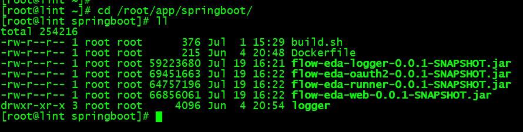

# Docker 部署

部署项目之前，需要先将项目所依赖的中间件服务部署好，正常运行后，再部署项目。

> 本项目部署的所有服务都在`/root/app/`目录下，你也可以对应修改为你自己的目录。

### 部署 Mysql

我们在`/root/app/`目录下新建一个`mysql`目录，然后在 mysql 目录下分别新建`data`目录和`conf.d`目录以及`my.cnf`文件。

```shell
cd /root/app
mkdir mysql
cd mysql
mkdir data
mkdir conf.d
touch my.cnf
```

其中，`my.cnf`文件用于配置数据库，其内容为：

```shell
[mysqld]
user=mysql
character-set-server=utf8
default_authentication_plugin=mysql_native_password
authentication_policy= mysql_native_password
secure_file_priv=/var/lib/mysql
expire_logs_days=7
sql_mode=STRICT_TRANS_TABLES,NO_ZERO_IN_DATE,NO_ZERO_DATE,ERROR_FOR_DIVISION_BY_ZERO,NO_ENGINE_SUBSTITUTION
max_connections=1000
secure_file_priv=/var/lib/mysql
skip-name-resolve=1

[client]
default-character-set=utf8

[mysql]
default-character-set=utf8
default-time-zone='+8:00'
```

然后我们执行 docker 命令，启动 mysql 服务。此处我们设置的 root 用户默认密码为`123456`，你也可以根据自身需求进行修改。

```shell
docker run --privileged=true -d -v /root/app/mysql/data/:/var/lib/mysql -v /root/app/mysql/conf.d:/etc/mysql/conf.d -v /root/app/mysql/my.cnf:/etc/mysql/my.cnf -p 3306:3306 --name mysql -e MYSQL_ROOT_PASSWORD=123456 mysql
```

执行成功后，可以使用`docker ps -a`命令查看容器运行状态。

你可以使用 Navicat 等 mysql 客户端工具进行连接，若连接成功，则 mysql 服务部署成功，正常运行。

> 注意服务器防火墙等因素可能会导致客户端无法连接的情况。

### 部署 RabbitMQ

我们在`/root/app/`目录下新建一个`rabbitmq`目录，然后在 rabbitmq 目录下新建`data`目录。此 data 目录用于存储 rabbitmq 服务的数据。

```shell
cd /root/app
mkdir rabbitmq
cd rabbitmq
mkdir data
```

然后我们执行 docker 命令，启动 rabbitmq 服务。

```shell
docker run -d -p 5672:5672 -p 15672:15672 --name rabbitmq -v /root/app/rabbitmq/data:/var/lib/rabbitmq rabbitmq
```

执行成功后，可以使用`docker ps -a`命令查看容器运行状态。

若需要开启 rabbitmq 的后台管理页面插件，则可以执行以下命令

```shell
docker exec -it rabbitmq bash
rabbitmq-plugins enable rabbitmq_management
exit
```

开启成功后，就可以使用 IP:15672 访问后台管理页面了，默认的用户名密码为`guest/guest`。

> 注意若服务器有防火墙，则需要开放对应端口。

### 部署 Nacos

若项目依赖了 nacos 服务作为服务注册中心，则需要部署 nacos 服务。

> 本项目提供了无注册中心部署，可以切换到项目分支 feign-replace-dubbo 进行打包部署，则不需要部署 nacos 服务。
> 有条件的情况下还是推荐使用 master 分支，部署 nacos 服务。

部署 nacos 服务稍微繁琐一点，主要是因为它需要连接到 mysql 数据库，便于持久化存储数据。

我们在部署 nacos 之前，需要先连接到我们的 mysql 数据库，创建一个名为`nacos_config`的数据库，然后导入 sql 文件。
本项目下载了 sql 文件，在项目`flow-eda-common`中，`sql/nacos_config.sql`文件。

创建好数据库，成功导入 sql 文件后，我们执行 docker 命令，启动 nacos 服务。
注意修改命令中的`MYSQL_SERVICE_HOST`和`MYSQL_SERVICE_PASSWORD`的值，分别为你的 mysql 服务的 ip 地址和 root 用户的密码。

```shell script
docker run -d -e MODE=standalone -e SPRING_DATASOURCE_PLATFORM=mysql -e MYSQL_SERVICE_HOST=host.docker.internal -e MYSQL_SERVICE_USER=root -e MYSQL_SERVICE_PASSWORD=123456 -e MYSQL_SERVICE_DB_NAME=nacos_config -e JVM_XMS=256m -e JVM_XMX=256m -e JVM_XMN=256m -p 8848:8848 -p 9848:9848 -p 9849:9849 --privileged=true --name nacos nacos/nacos-server
```

执行成功后，可以使用`docker ps -a`命令查看容器运行状态。若遇到部署问题，可以查看[官方 issues](https://github.com/alibaba/nacos/issues)寻找类似的问题和解决方案。

### 打包 Docker 镜像

我们可以将项目的 jar 包打包成 docker 镜像，便于进行 docker 部署。项目的 jar 包来源详见[项目打包](deploy/packaging.md)。

我们在`/root/app/`目录下新建一个`springboot`目录，在 springboot 目录下新建一个`logger`目录，
在 logger 目录下新建一个`logs`目录，用于存放项目的日志文件。

```shell
cd /root/app
mkdir springboot
cd springboot
mkdir logger
cd logger
mkdir logs
cd /root/app/springboot
```

然后我们回到`springboot`目录中，将打包好的项目 jar 包上传至此目录下。
再将 flow-eda 项目根目录下的`Dockerfile`文件和`build.sh`文件上传至 springboot 目录中。



我们项目打包使用的基础镜像是`anapsix/alpine-java`镜像，我们在打包镜像前需要先拉取该镜像，避免拉取镜像时间过长导致项目打包失败。
执行命令拉取基础镜像：

```shell
docker pull anapsix/alpine-java
```

基础镜像拉取成功后，我们执行命令`sh build.sh`开始打包 docker 镜像，此命令可以将项目的 jar 包打包为`docker image`。

```shell
sh build.sh
```

打包完成后，使用命令`docker images`查看镜像列表。

```shell
docker images
```


### 部署后端应用

当后端项目所依赖的中间件服务部署完成、正常运行后，我们就可以开始部署后端服务了。

先将项目 jar 包[打包 Dokcer 镜像](deploy/docker?id=打包-docker-镜像)，镜像打包成功后，就可以使用 docker 命令进行部署。

项目 flow-eda 根目录下的`start.sh`文件提供了 docker 启动脚本，你可以将该文件上传至服务器，执行`sh start.sh`命令启动，
也可以直接执行以下命令：

```shell
docker run -d -p 8086:8086 flow-eda-oauth2
docker run -d -p 8082:8082 -v /root/app/springboot/logger/logs:/logs flow-eda-logger
docker run -d -p 8088:8088 flow-eda-runner
docker run -d -p 8081:8081 flow-eda-web
```

执行成功后，可以使用`docker ps -a`命令查看容器运行状态。

### 部署前端应用

前端应用我们使用 Nginx 进行部署，由于 nginx 的默认端口为 80 端口，
我们有 vue 和 react 两个前端项目，你可以按需部署，将你想要部署的项目部署到 80 端口即可。

这里我们为了演示，将两个前端项目都进行部署。将 vue 项目部署到 80 端口，将 react 项目部署到 90 端口。

#### 部署 Nginx

我们在`/root/app/`目录下新建一个`nginx`目录，然后在 nginx 目录下分别新建`conf`、`logs`、`www`目录。

```shell
cd /root/app
mkdir nginx
cd nginx
mkdir conf
mkdir logs
mkdir www
```

我们将前端项目打好的包上传到`/root/app/nginx/www`目录下，前端包来源详见[项目打包](deploy/packaging.md)。
上传好之后，在`www`目录下就会有两个项目包`vue`和`react`目录。

我们需要写入一些 nginx 的配置，在`conf`目录下，新建一个`nginx.conf`文件，其内容为

```shell
user root;
worker_processes auto;
error_log  /var/log/nginx/error.log notice;
pid        /var/run/nginx.pid;
events {
    worker_connections  1024;
}
http {
    include       /etc/nginx/mime.types;
    default_type  application/octet-stream;
    log_format  main  '$remote_addr - $remote_user [$time_local] "$request" '
                      '$status $body_bytes_sent "$http_referer" '
                      '"$http_user_agent" "$http_x_forwarded_for"';
    access_log  /var/log/nginx/access.log  main;
    sendfile        on;
    #tcp_nopush     on;
    keepalive_timeout  65;
    #gzip  on;
    include /etc/nginx/conf.d/*.conf;
}
```

然后我们在`conf`目录下，新建一个`conf.d`目录，在 conf.d 目录下新建一个`default.conf`文件，其内容为

```shell
server {
    listen       80;
    listen  [::]:80;
    server_name  localhost;
    location / {
        root   /www/vue;
        index  index.html index.htm;
    }
    location /api/ {
        proxy_pass http://192.168.0.4:8081;
        proxy_set_header Host $http_host;
        proxy_set_header X-Real-IP $remote_addr;
        proxy_set_header X-Forwarded-For $proxy_add_x_forwarded_for;
        proxy_set_header REMOTE-HOST $remote_addr;
        proxy_set_header X-NginX-Proxy true;
        proxy_redirect   default;
    }
    location /oauth/ {
        proxy_pass http://192.168.0.4:8086;
        proxy_set_header Host $http_host;
        proxy_set_header X-Real-IP $remote_addr;
        proxy_set_header X-Forwarded-For $proxy_add_x_forwarded_for;
        proxy_set_header REMOTE-HOST $remote_addr;
        proxy_set_header X-NginX-Proxy true;
        proxy_redirect   default;
    }
}

server {
    listen       90;
    listen  [::]:90;
    server_name  localhost;
    location / {
        root   /www/react;
        index  index.html index.htm;
    }
    location /api/ {
        proxy_pass http://192.168.0.4:8081;
        proxy_set_header Host $http_host;
        proxy_set_header X-Real-IP $remote_addr;
        proxy_set_header X-Forwarded-For $proxy_add_x_forwarded_for;
        proxy_set_header REMOTE-HOST $remote_addr;
        proxy_set_header X-NginX-Proxy true;
        proxy_redirect   default;
    }
    location /oauth/ {
        proxy_pass http://192.168.0.4:8086;
        proxy_set_header Host $http_host;
        proxy_set_header X-Real-IP $remote_addr;
        proxy_set_header X-Forwarded-For $proxy_add_x_forwarded_for;
        proxy_set_header REMOTE-HOST $remote_addr;
        proxy_set_header X-NginX-Proxy true;
        proxy_redirect   default;
    }
}
```

如上述配置所见，配置了两个 server，分别监听 80 端口和 90 端口，分别对应了 vue 和 react 项目。
若部署时只需要部署单个前端项目，则仅需要配置 80 端口即可。

> 注意修改`default.conf`配置中的 proxy_pass 项为你的后端项目 IP 地址，若前后端项目部署在同一台服务器上，则可以为内网 IP。

上传好前端项目包，配置好 nginx 配置文件后，我们就可以执行 docker 命令，启动 nginx 服务了。

```shell
docker run -d -p 80:80 -p 90:90 --name nginx -v /root/app/nginx/www:/www -v /root/app/nginx/conf/nginx.conf:/etc/nginx/nginx.conf -v /root/app/nginx/conf/conf.d/default.conf:/etc/nginx/conf.d/default.conf -v /root/app/nginx/logs:/wwwlogs nginx
```

执行成功后，可以使用`docker ps -a`命令查看容器运行状态。


若各容器均部署成功正常运行，可以使用浏览器访问 IP:80，查看 vue 的首页；访问 IP:90，查看 react 的首页。功能均正常，则项目部署完成。
