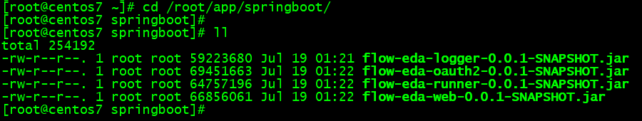
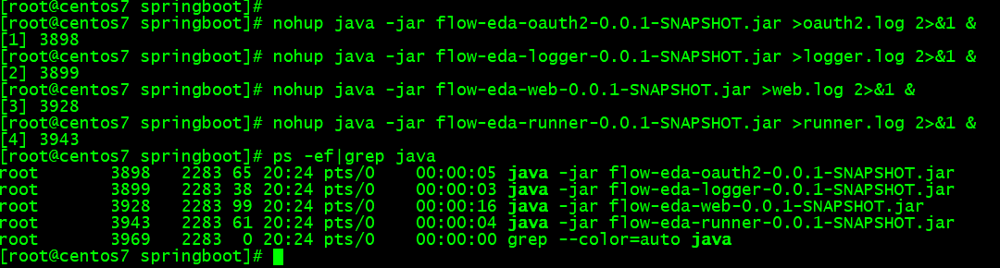
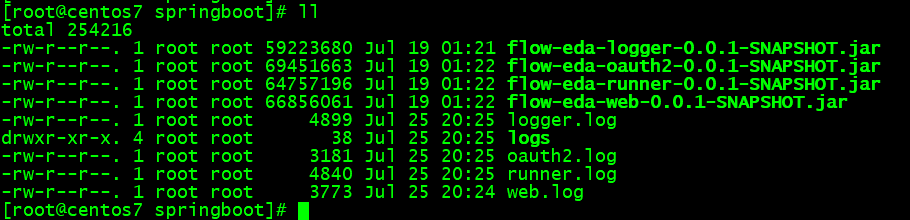
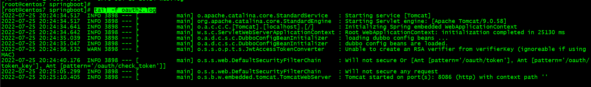
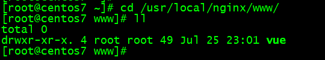
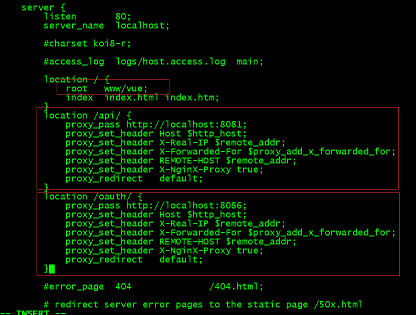
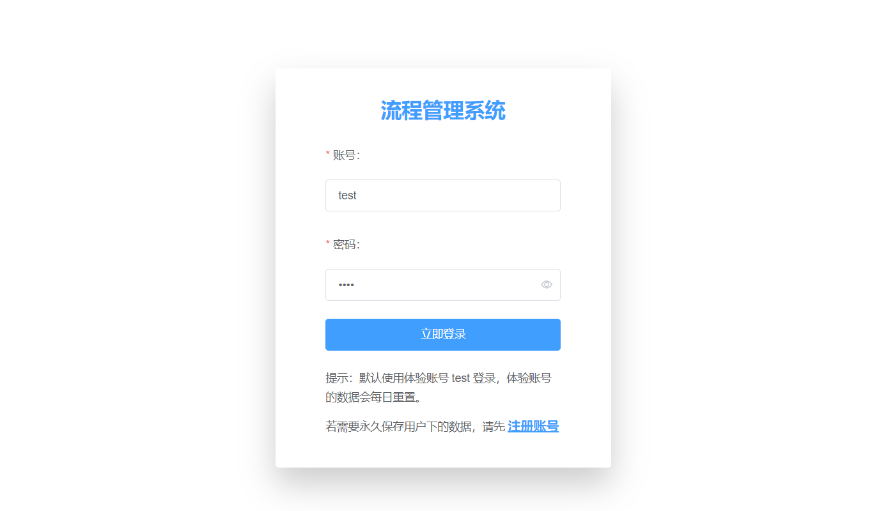

# Linux 环境部署

当我们的 linux 服务器上没有安装 docker 环境时，可以采用直接安装应用的方式来部署项目。

### 安装中间件服务

本项目依赖的中间件服务有`Mysql`、`RabbitMQ`、`Nacos`，我们需要在 linux 服务器上安装这些中间件服务。

具体安装过程网上资料繁多，请自行搜索查看，这里提供几个博客可供参考：

- [Linux 安装 Mysql](https://blog.csdn.net/Lin_xiaofeng/article/details/87628833)
- [Linux 安装 RabbitMQ](https://blog.csdn.net/Lin_xiaofeng/article/details/87857536)
- [Linux 安装 Nacos](https://blog.csdn.net/Mr_7777777/article/details/123133036)

安装好中间件服务后，需要使用 Navicat 或其它客户端工具连接到 Mysql 数据库，[导入 sql 文件](advanced/local-start?id=导入-sql-文件)。

### 部署后端应用

当后端项目所依赖的中间件服务部署完成、正常运行后，我们就可以开始部署后端服务了。
这里采用运行 jar 包的方式来部署后端项目，项目的 jar 包来源详见[项目打包](deploy/packaging.md)。

首先需要在你的 linux 服务器上安装 java 环境，请参考[linux 安装 jdk 环境](https://blog.csdn.net/Lin_xiaofeng/article/details/87626658)。

我们在`/root/app/`目录下新建一个`springboot`目录，然后将项目的 jar 包全部上传至`springboot`目录。



接下来我们启动项目，执行以下命令（后台启动项目，并指定了输出日志文件）。

```shell
nohup java -jar flow-eda-oauth2-0.0.1-SNAPSHOT.jar >oauth2.log 2>&1 &
nohup java -jar flow-eda-logger-0.0.1-SNAPSHOT.jar >logger.log 2>&1 &
nohup java -jar flow-eda-web-0.0.1-SNAPSHOT.jar >web.log 2>&1 &
nohup java -jar flow-eda-runner-0.0.1-SNAPSHOT.jar >runner.log 2>&1 &
```

启动好项目之后，可以使用`ps -ef|grep java`命令查看 java 进程。



若要停止某一进程，可以使用`kill -9 <PID>`命令，上图中的第一列数字就是对应进程的 PID。
如 oauth2 服务的进程 PID 是 3898，使用`kill -9 3898`命令就可以停止 oauth2 服务。

服务都启动好之后，可以看到在当前目录下自动生成了对应的日志文件，其中`logs`目录为日志管理服务用于存储流程运行日志和操作日志的目录。



可以使用命令`tail -f xxx.log`查看各个应用的实时日志，检查各个应用是否启动正常。



至此，后端项目就部署好了。

### 部署前端应用

前端应用我们使用 Nginx 进行部署，首先需要在 linux 上安装 nginx 服务，可参考[linux 安装 nginx 并配置反向代理](https://blog.csdn.net/Lin_xiaofeng/article/details/125992996)。
我们有 vue 和 react 两个前端项目，你可以按需部署，将你想要部署的项目配置到 80 端口即可，也可以将两个项目都部署，配置不同端口即可。（下面我们以 vue 项目为例进行部署）

安装好 nginx 服务之后，我们需要将前端项目打好的包上传至 nginx 服务的 www 目录下，前端包来源详见[项目打包](deploy/packaging.md)。

```shell
cd /usr/local/nginx
mkdir www
```



然后我们需要配置反向代理，编辑`/usr/local/nginx/conf`目录下的`nginx.conf`文件

```shell
cd /usr/local/nginx/conf
vi nginx.conf
```

需要将 root 目录改完你上传的包的路径，然后需要配置项目所需要的反向代理



配置完之后，重启 nginx 服务，打开浏览器，访问你的服务器 IP 地址，默认 80 端口。测试平台是否功能完好，没有异常。



至此，linux 环境项目部署完成。
