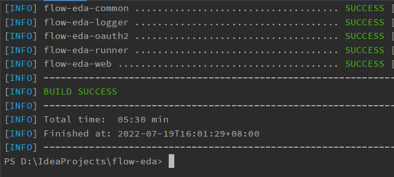
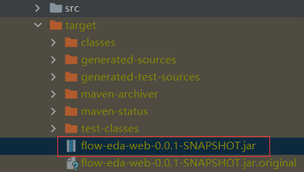
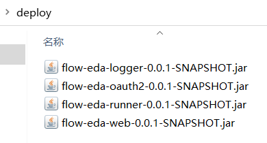
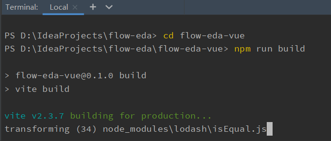
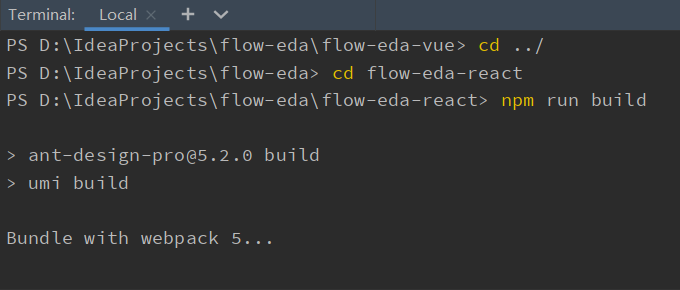
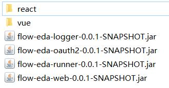

# 项目打包

当我们要部署项目时，应保证先部署好项目所需要的一些中间件服务，然后再进行项目服务的部署。

在进行项目部署前，需要先对项目进行打包。

> 若采用 docker 等命令行部署方式，也可以将项目打包命令写入到部署命令一起执行。

### 修改配置文件

当我们在确定好部署的服务器 IP 地址后，需要在项目打包前修改配置文件，以确保部署的服务能够正确地运行。

> 此处修改项目配置文件，仅仅是为了打包。若需要本地启动项目注意要修改回来。

#### 修改后端配置文件

当我们部署后端服务前，需要先将后端服务所依赖的一些中间件服务部署好，然后将这些中间件服务的 IP 地址或域名填写到后端项目的配置文件中。

例如：我们已经部署好了`mysql`,`rabbitmq`,`nacos`等中间件服务，假设我们将这些服务都部署在同一台服务器上，我们假设服务器 IP 地址为`127.0.0.1`。
那么我们需要在后端项目的配置文件中修改对应内容，将`localhost`修改为`127.0.0.1`，同时检查项目配置中的用户名密码等，进行对应修改。


> 所有后端服务的配置文件都要进行修改。

#### 修改前端配置文件

前端配置修改与后端稍有不同，前端项目需要修改的配置目前暂时只有一个 Websocket 服务器 IP 地址的配置，需要获取后端服务部署的服务器 IP 地址或域名。

此处假设我们后端项目部署的 IP 地址为`127.0.0.1`，那么它也是我们的后端 Websocket 服务的 IP 地址。

- 对于`flow-eda-vue`项目，我们需要修改`src`目录下的`main.js`文件，将最后一行的`localhost`修改为对应 IP 地址。

```js
window.$wsIp = "ws://127.0.0.1";
```

- 对于`flow-eda-react`项目，我们需要修改`src`目录下的`global.tsx`文件，将最后一行的`localhost`修改为对应 IP 地址。

```tsx
export const wsIp: string = "ws://127.0.0.1";
```

> 需要部署哪个项目就修改哪个项目，若都部署则都需要修改。

### 打包后端项目

后端项目采用 java8 或以上、小于 17 的 jdk 版本编译。项目构建需要安装 maven 构建管理工具，打包后端项目可以使用你的 IDE 编辑器自带的打包构建工具，也可以使用命令行打包。

此处我们仅介绍命令行打包方式。在项目根目录下执行打包命令：

```shell
mvn clean package
```


首次打包会稍微有点慢，因为要下载各种依赖等。待其打包完毕后，显示如下图所示，就代表打包成功了。



此时需要手动将打好的各个 jar 包复制出来，jar 包位置在各个项目的`target`目录下。
我们在桌面或方便的位置新建一个文件夹，将 jar 包复制到该文件夹内（也可以直接将 jar 包放在桌面），待部署时使用。




### 打包前端项目

前端项目打包需要安装 node 和 npm 环境，可以使用 yarn 或 npm 命令进行打包，此处我们使用 npm 命令进行打包。

- 打包 vue 项目

```shell
# 进入项目目录
cd flow-eda-vue
# 打包
npm run build
```



- 打包 react 项目

```shell
# 进入项目目录
cd flow-eda-react
# 打包
npm run build
```



> 作者在开发时使用的 node 版本为 v14.18.0，npm 的版本为 7.13.0，若遇到打包问题，请尝试调整下版本。

前端项目打包好之后，需要将打包产生的 dist 文件夹复制到刚刚存放 jar 包的文件夹内。
我们将 vue 项目下复制过来的 dist 文件夹重命名为`vue`，将 react 项目下复制过来的 dist 文件夹重命名为`react`，
这样做是为了在部署时区分这两个项目，如果你仅需要部署单个前端项目，则不需要进行区分，直接用 dist 就可以。

至此，我们的项目打包就完成了，准备好文件待部署时使用。


