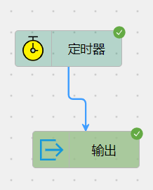
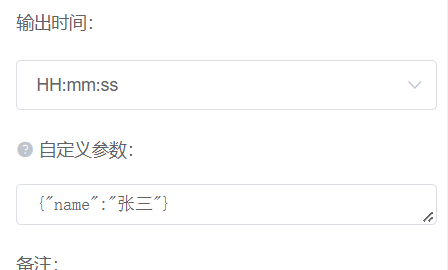
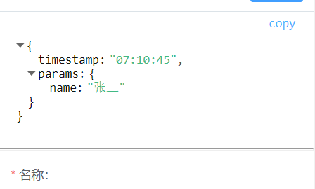

# 节点自定义参数

每个节点的属性栏中都有一个自定义参数，用户可以根据自己的需求为节点添加自定义参数。

### 使用说明

自定义参数规定为 json 格式，若填写格式不规范，则保存时会提示格式错误。

用户可以在某节点上设置自定义参数的值，传递至下一节点；也可以在自定义参数处接收上一节点的值，继续向下传递。
自定义参数可以在节点之间无限传递，但它仅能从上一节点传递至下一节点，不能跨节点传递。
这是因为每个节点的输出参数都会作为下一节点的输入参数，若其中一个节点未接收指定的值，则下一节点就无法获取到该值。

节点的自定义参数可以被下一节点使用，若直接使用输出节点来输出上一节的的参数内容，
为了和节点本身的输出参数区分开，自定义参数会统一输出在`params`字段中。

例如：一共有 3 个节点，按 1-2-3 连接，节点 1 填写的自定义参数为`{"name": "张三"}`，
节点 2 需要将该值传递下去，则节点 2 的自定义参数填写为`{"name": "${name}"}`，则节点 3 就可以使用`${name}`直接获取到该值。

> 若上一节点定义了自定义参数，本节点可在属性栏任意参数的任意位置使用`${xx}`即可直接获取到该值。

### 使用示例

我们通常使用自定义参数有如下两个场景：

- 定义参数：向下游多个节点传递同一参数，避免多次重复定义。
- 传递参数：将上游的自定义参数传递至下游，供下游节点使用。

下面我们通过一个流程示例来了解自定义参数的使用。

上图所示的案例很好的展示了参数传递的使用场景，实际使用中，我们可以用这种方式来传递上游节点的参数。
需要注意的是，自定义参数取值时，不限制参数来源。意思是可以从上游节点的输出参数中任意参数字段取值，然后向下传递。

自定义参数还有一种用法就是定义参数，由一个节点定义好参数，由该节点引出许多下游节点，都可以共同使用这同一份参数。

例如：由开始节点定义好参数`{"url": "http://xxxx"}`，该节点同时连接下游多个 HTTP 请求节点，
那么在这多个 HTTP 请求节点中填写 url 属性时，就可以使用`${url}`来代替参数值。
