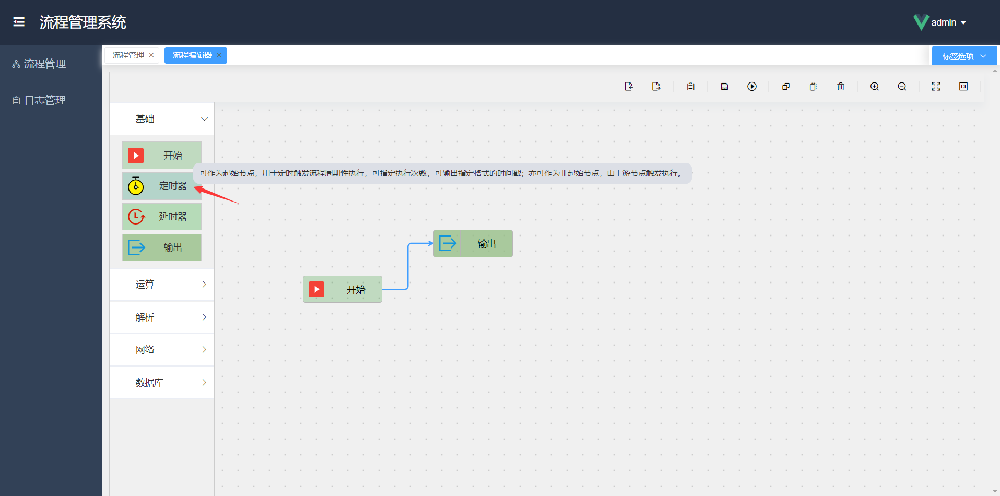
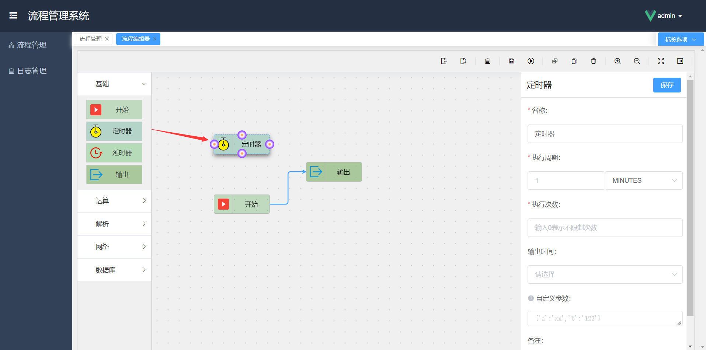
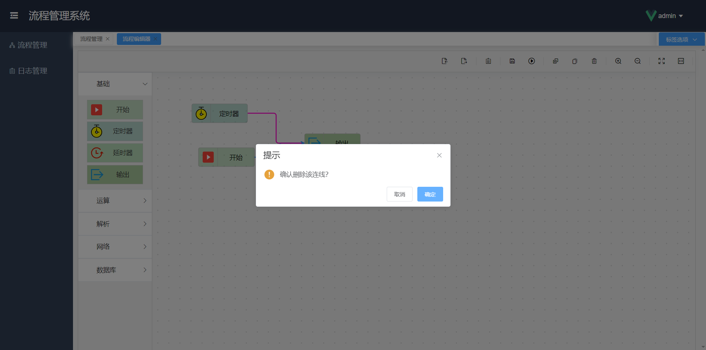
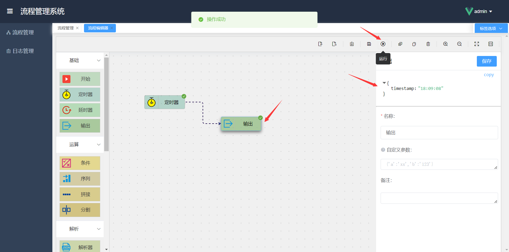

### 拖拽节点

绘制流程图时，需要从左侧功能节点列表中找到自己需要的功能节点，并将其拖拽到流程图中。

**拖拽步骤：**

- 将鼠标指针移动至左侧的节点列表中，选择要拖拽的节点
- 用鼠标左键按住该节点不要松开，移动鼠标拖拽至右侧的绘图区域中，松开鼠标
- 此时该节点已经被拖拽到流程图中，重复此方法还可以移动各节点的位置，将每个节点拖动到合适的位置，排列摆放好

#### 查看节点功能描述

将鼠标移动至左侧的节点上，可以查看该节点对应的功能描述。

若遇到不清楚其功能的节点，可以查看其对应的功能描述来了解并使用该节点。

### 填写节点属性

每个节点都有自己的功能属性，我们在绘图过程中，可以根据不同的需求来填写节点的属性值，从而控制流程运行时的“变量值”。

从左侧将节点拖拽至绘图区域后，点击一下该节点，此时该节点为选中状态，绘图区域右侧会出现该节点的属性面板，可以通过该面板来查看并设置该节点的属性值。

**属性划分：**

- 名称：每个节点的固定属性，节点名称可以按需修改，节点名称将会直观的展示在流程图中。
- 特有属性：每个节点根据其功能不同，会有一些自己特有的属性参数，有些简单的节点也可以没有特有属性。
- 自定义参数：每个节点都有自定义参数属性，用于设置自定义的一些参数，详见[自定义参数](getting-started/custom-params.md)。
- 备注：每个节点的固定属性，可以为该节点添加备注，用于标识该节点的特殊作用或描述。

> 注意每次修改完节点属性后，**一定要点击属性面板上的保存按钮！**

**需要注意的是：**

- 每个节点根据其功能的不同，参数（节点属性）要求会有差异
- 节点属性名前带有 \* 号，表示该属性为必填项
- 若一个流程中存在必填项未填写的情况，则在运行流程时会弹出错误信息，明确提示哪个节点的哪个属性未填写。

此处我们填写[定时器]节点的属性值，设置其执行周期为 3 秒，共执行 2 次，并选择输出时间格式。（见下图）

### 节点连线

我们将绘图区域中的节点按照流程（业务）执行顺序进行连线。每个节点上的连线不限制条数和方向，便于更好的扩展复杂的业务流程。

我们一般将要引出连线的节点称为“源节点”，将被连接的节点称为“目标节点”。

**连线步骤：**

- 将鼠标指针移动至源节点上，此时该节点四周会出现四个锚点
- 用鼠标左键按住该节点其中一个锚点，移动鼠标至目标节点上
- 此时目标节点四周也会出现锚点，将鼠标移动至要连接的锚点上，松开鼠标，就完成了这两个节点间的连线

在节点之间连线完成后，该流程图可以算作基本绘制完成。

#### 删除连线

当想要删除连线时，将鼠标移动到该连线上，连线会变红，双击该红色连线，会弹出删除确认提示框，点击确定即可删除该连线。

### 快捷键

我们在绘制流程图时，可以使用一些常用的快捷键操作来大大简化绘图过程，下面将介绍一些目前支持的常用快捷键。

**删除节点：**

选中节点后，按 **_Delete_** 键即可删除节点。

**复制粘贴：**

选中节点后，按 **_Ctrl+C_** 键即可复制节点，按 **_Ctrl+V_** 键即可粘贴节点。

**缩放**

- 放大：鼠标滚轮向前滚动，即可放大绘图面板比例
- 缩小：鼠标滚轮向后滚动，即可缩小绘图面板比例
- 重置：双击绘图面板，即可重置缩放比例

### 运行流程

绘制好流程图后，点击工具栏的运行按钮，即可运行流程。（见下图）

### 查看输出

当我们需要查看流程的运行输出结果时，需要在流程中连接一个[输出]节点，运行流程后，选中该输出节点，即可在绘图区域右侧的属性栏中查看到该节点的输出内容。

