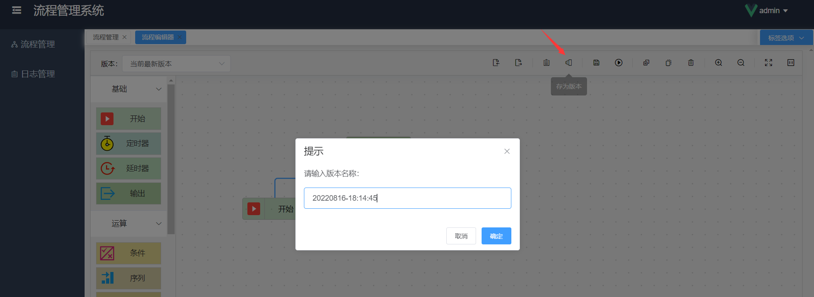
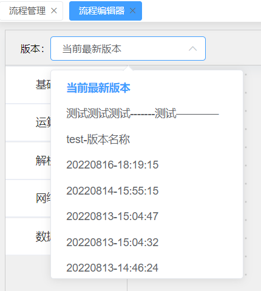

# 工具栏

在绘图区域上方有一条工具栏，含有各种绘图功能，它的主要作用是辅助绘图。将鼠标移动上去会显示其功能名称，下面我们进行一一介绍。

> 部分功能可以使用快捷键直接操作，详情请查看[快捷键](getting-started/flow-editor?id=快捷键)。

### 导出

导出功能可以将当前面板所绘制的流程图，导出为 json 格式的数据，并复制到当前系统剪切板上。

此功能的意义是，当需要绘制多个类似的流程图时，可以快速导出当前流程图并导入到其他流程图中，节省了大量的重复工作。

### 导入

导入功能通常和导出配合使用，导出是将当前流程图内容导出为 json 格式的数据，复制到剪切板上；
而导入则是从当前系统剪切板上读取 json 数据并生成流程图。

### 查看日志/关闭日志

点击工具栏上的查看日志，在绘图区域下方会出现一块背景为暗色的日志区域，我们称之为“日志栏”，用户可以上下拖动调节该日志栏的高度。
此日志栏是用于展示流程运行时的实时日志，当流程运行时，产生的运行日志会实时更新到此日志栏，并会自动滚动到最新行。

当点击查看日志后，该按钮会变成关闭日志，点击关闭日志，则会关闭日志栏。

### 存为版本

当我们绘制好流程图，需要保存为多个不同的版本时，可以使用存为版本功能。
此功能可以将当前编辑器内的流程图保存为一个新的版本，可以在工具栏的左侧切换并查看各版本数据。

存为新版本时，需要填写版本名称，即版本号，用于标识当前你保存的版本的用途，便于区分。
系统默认的版本名称为当前时间，您可以根据需要自行修改。

我们可以在工具栏左侧查看版本列表，选择版本进行切换，编辑器会自动加载新的流程图。

当我们切换到某个版本后，若是需要进行更新保存或运行，则系统会自动将当前修改后的流程存为当前最新版本，并自动切换至当前最新版本。

### 保存

当流程图绘制完成后，我们需要点击此保存按钮，将当前的流程图数据保存。若绘制好的流程图还未点击保存页面就被关闭，则新绘制的内容会丢失。

> 点击运行按钮时，会自动保存，并运行流程。

### 运行

当流程图绘制完成后，我们可以点击运行按钮，运行本流程。

运行流程时，可能会发生一些异常提示消息，用户可以根据提示的消息内容来判断出现异常的原因，比如某些节点的必填参数未填写等原因。

若遇到解决不了的异常，可以创建项目 issue，也可以添加[交流群](introduce/overview?id=交流群)进行技术交流或免费获得技术支持。

当点击运行按钮后，当前流程开始运行，并实时展示运行状态。每个节点的右上角都会展示该节点的实时运行状态图标，
若节点右上角没有状态图标，则表示暂未运行到该节点。

节点共有 3 种运行状态：

- 运行中，此状态图标为一个浅灰色的转圈加载图标，表示当前节点正在持续运行中，还未执行完毕
- 运行完成，此状态图标为一个绿色的✔，表示当前节点已执行完毕
- 运行失败，此状态图标为一个红色的×，表示当前节点运行发生错误，已停止运行

将鼠标移动至节点右上角的状态图标上悬停，则会展示当前状态信息，若该节点发生错误，则会看到具体的异常信息。

如上图所示，该定时器节点的“次数”属性未填写，用户只需要根据错误信息来判断异常原因，并进行对应的修改，填写好参数后，再次点击运行，则流程正常运行。

### 停止

当流程运行时，若短时间内（2 秒左右）未运行完毕，则该流程当前处于 [运行中] 状态，此时，原来的运行按钮会变成停止按钮，便于用户可以随时停止当前流程的运行。

点击停止按钮，弹出二次确认框，确认之后，会立即中止当前流程的运行。流程停止后该按钮又会变为运行按钮，可再次运行流程。

### 复制/粘贴

在我们绘制流程图的过程中，有些时候需要用多个相同的节点，但又不想重复填写节点参数，这时候就可以复制该节点。

选中要复制的节点，点击复制按钮，则复制成功。再点击粘贴按钮，即可在该节点的右下角复制粘贴出新节点。一次复制，可无限粘贴。

### 删除

当我们绘制流程图时，想要删除不需要的节点，可以选中该节点，点击删除按钮，即可删除该节点。

> 提示：删除某个节点后，连接在该节点上的连线会被一起删除

### 放大/缩小

绘制流程图时，可以点击放大/缩小来调整当前绘图面板的大小比例。

### 全屏/重置

点击全屏按钮，可以将当前绘制面板全屏展示。当绘图面板放大/缩小后，可以点击重置按钮来重置绘制面板的缩放比例，默认比例为 1:1。
