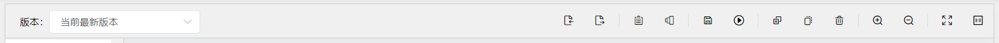
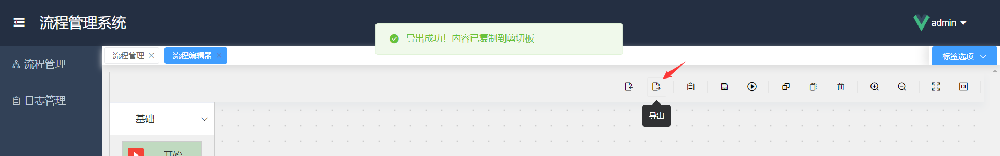
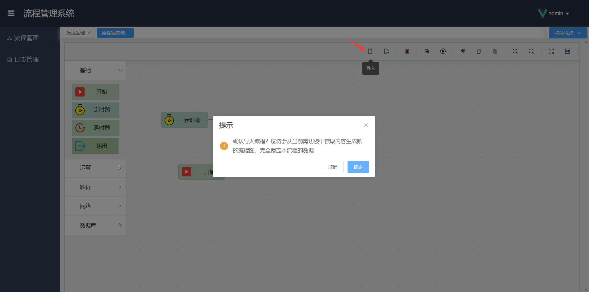
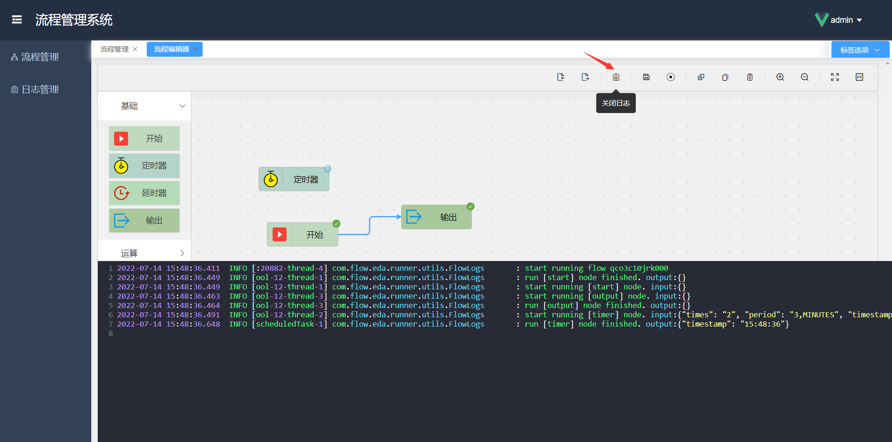
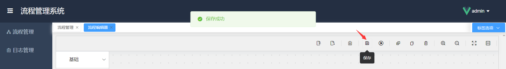
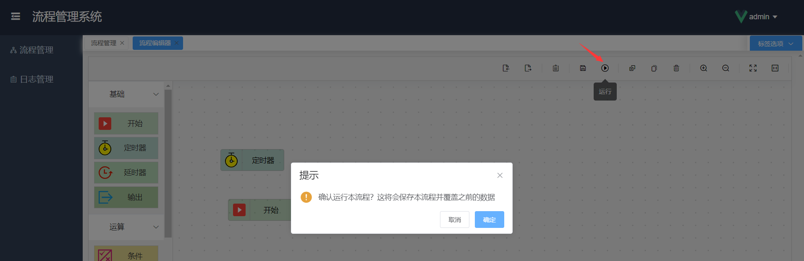
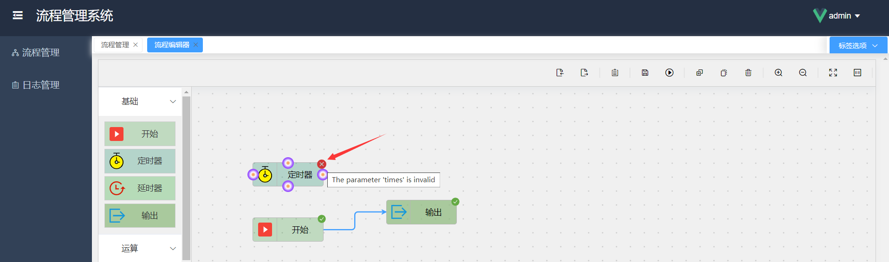
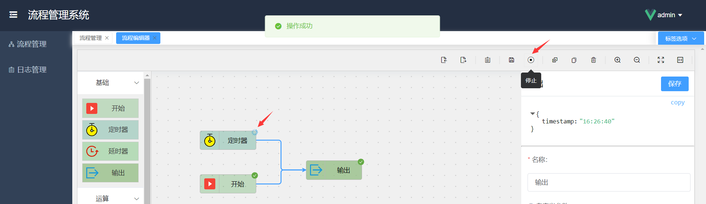
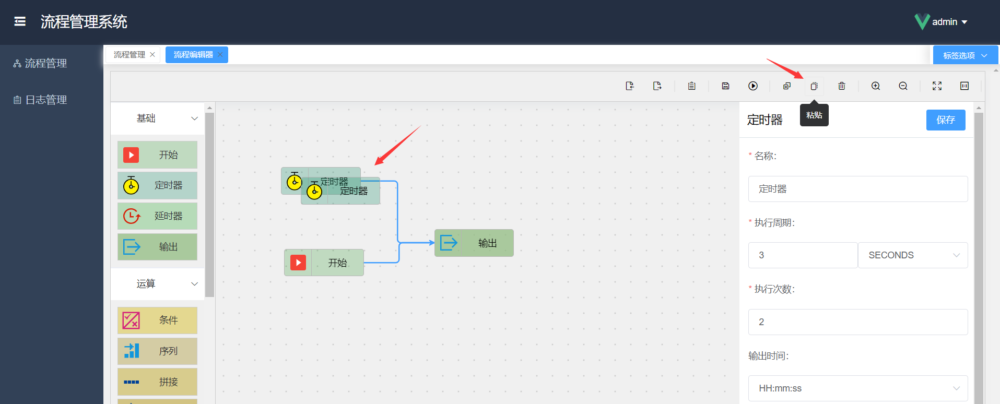
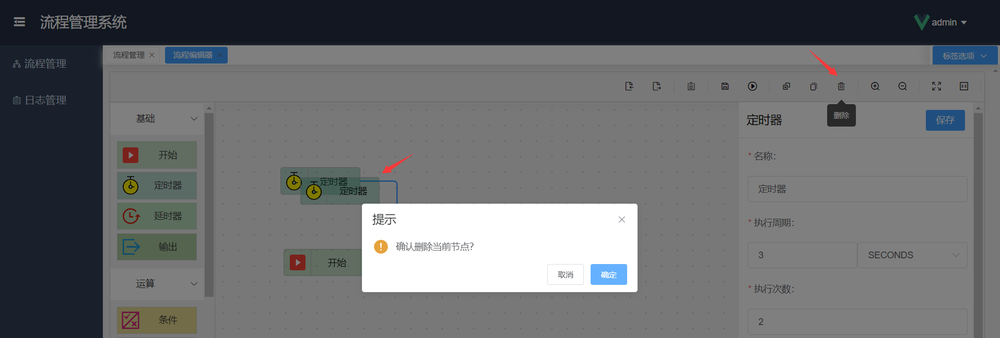

# 工具栏

在绘图区域上方有一条工具栏，它的主要作用是辅助绘图，含有各种功能。将鼠标移动上去会显示其功能名称，下面我们进行一一介绍。

### 导出

导出功能可以将当前面板所绘制的流程图，导出为 json 格式的数据，并复制到当前系统剪切板上。

此功能的意义是，当需要绘制多个类似的流程图时，可以快速导出当前流程图并导入到其他流程图中，节省了大量的重复工作。

### 导入

导入功能通常和导出配合使用，导出是将当前流程图内容导出为 json 格式的数据，复制到剪切板上；而导入则是从当前系统剪切板上读取 json 数据并生成流程图。

### 查看日志/关闭日志

点击工具栏上的查看日志，在绘图区域下方会出现一块背景为暗色的日志区域，我们称之为“日志栏”，该日志栏的高度可以上下拖动调节。此日志栏是用于展示流程运行时的实时日志，当流程运行时，产生的运行日志会实时更新到此日志栏，并会自动滚动到最新行。

当点击查看日志后，该按钮会变成关闭日志，点击关闭日志，则会关闭日志栏。

### 保存

当流程图绘制完成后，我们需要点击此保存按钮，将当前的流程图数据保存。若绘制好的流程图还未点击保存页面就被关闭，则新绘制的内容会丢失。

### 运行

当流程图绘制完成后，我们可以点击运行按钮，运行本流程。

运行流程时，可能会发生一些异常提示消息，针对提示的消息内容判断是什么原因，比如某些节点必填参数未填写、流程图绘制错误等场景错误。若遇到解决不了的异常，可以添加[交流群](introduce/overview?id=交流群)进行技术交流或免费获得技术支持。

当点击运行按钮后，当前流程开始运行，并实时展示运行状态。每个节点的右上角会展示该节点的实时运行状态，共有 3 种状态：

- 运行中，此状态图标为一个浅灰色的转圈加载图标，表示当前节点正在持续运行中，还未执行完毕
- 运行完成，此状态图标为一个绿色的✔，表示当前节点已执行完毕
- 运行失败，此状态图标为一个红色的×，表示当前节点运行发生错误

将鼠标移动至节点右上角的状态图标上悬停，则会展示当前状态信息，若该节点发生错误，则会看到具体的异常信息。

如上图所示，该定时器节点的“次数”属性未填写，只需要根据错误信息判断出原因，并对应进行修改，填写好参数后，再次运行，则正常执行。

### 停止

当流程运行时，若短时间内（2 秒左右）未运行完毕，则该流程当前处于 [运行中] 状态，此时，原来的运行按钮会变成停止按钮，便于用户可以随时中止当前流程的运行。

点击停止按钮，弹出二次确认框，确认之后，会立即中止当前流程的运行。流程停止后该按钮又会变为运行，可再次运行流程。

### 复制/粘贴

在我们绘制流程图的过程中，有些时候需要用多个相同的节点，但又不想重复填写节点参数，这时候就可以复制该节点。

选中要复制的节点，点击复制按钮，则复制成功。再点击粘贴按钮，即可在该节点的右下角复制粘贴出新节点。一次复制，可无限粘贴。

### 删除

当我们绘制流程图时，想要删除不需要的节点，可以选中该节点，点击删除按钮，即可删除该节点。

> 提示：删除某个节点后，连接在该节点上的连线会被一起删除

### 放大/缩小

绘制流程图时，可以点击放大/缩小来调整当前绘图面板的大小比例。

### 全屏/重置

点击全屏按钮，可以将当前绘制面板全屏展示。点击放大/缩小后，可以点击重置来重置绘制面板的缩放比例，默认比例为 1:1。
