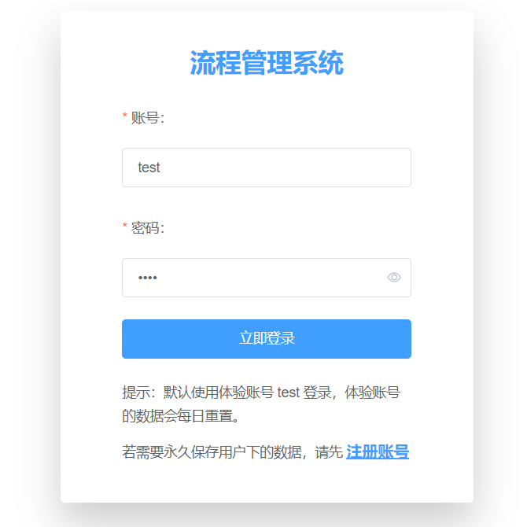
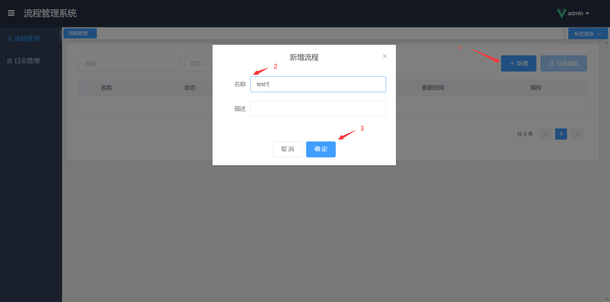
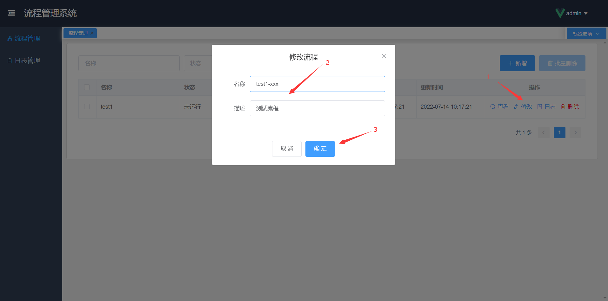
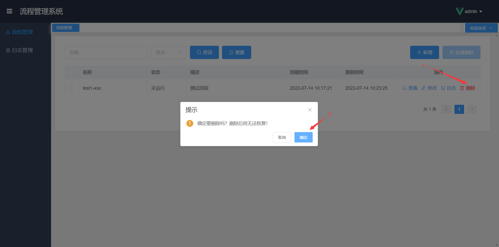
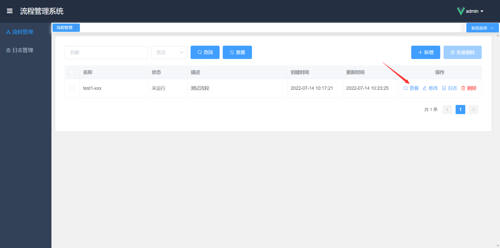
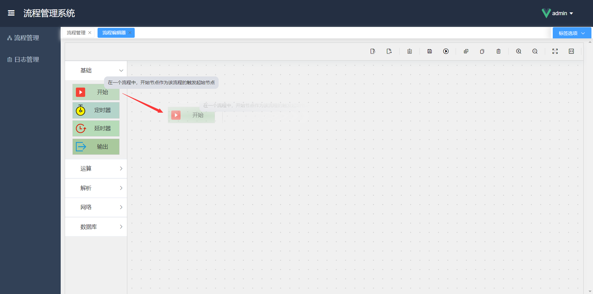
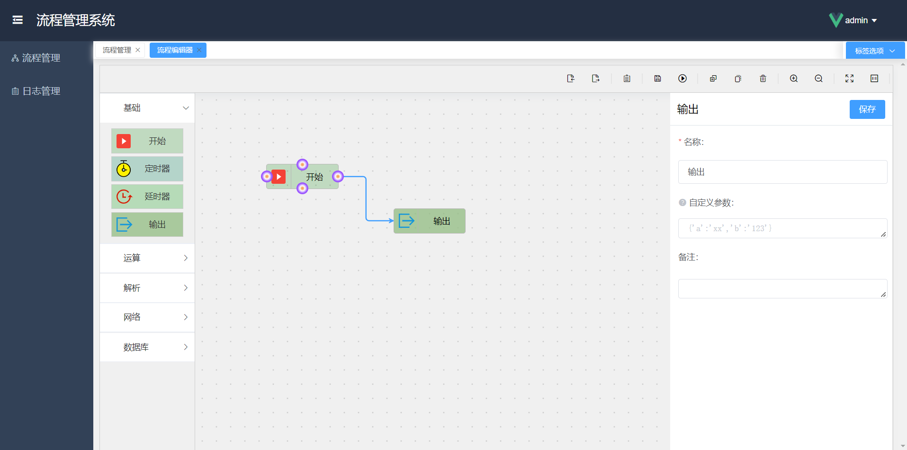
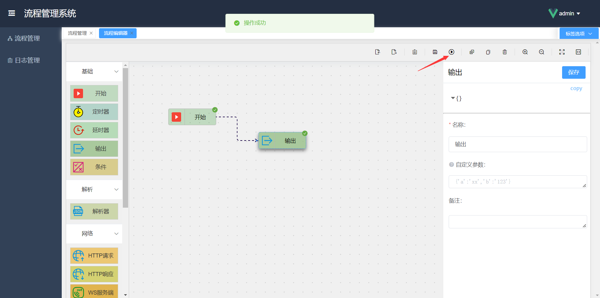
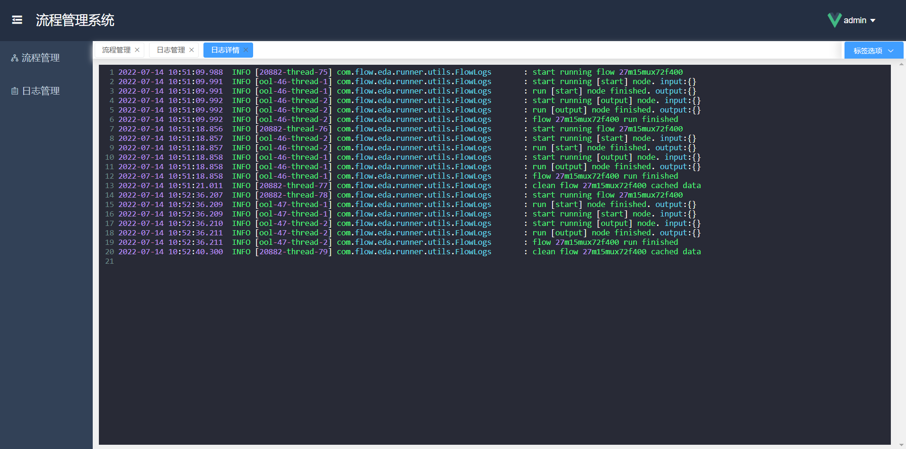
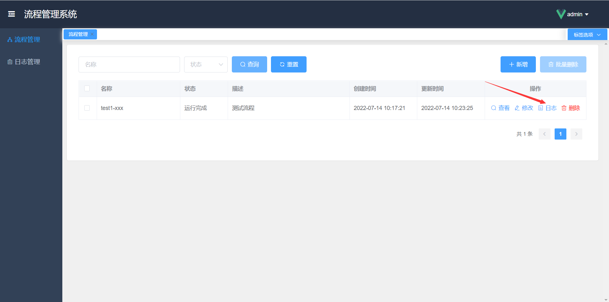

### 登陆注册

演示环境提供了演示账号，您可以直接登录使用。注意该演示账号下的数据每日都会重置，如果您需要保留自己的数据，可以点击注册账号，填写账号密码即可注册成功。

### 流程管理

用户登陆后，默认会展示当前用户账号下的流程列表，新建的账号下暂无流程数据。

#### 新增流程

#### 修改流程

#### 删除流程

#### 查看流程（打开流程图）

### 绘制流程图

点击查看流程，打开流程编辑页面后，就可以开始绘制流程图了。

**绘图步骤：**

- 先从左侧的节点列表中选择节点，用鼠标左键按住该节点不松开，拖拽至右侧的绘图区域，再松开鼠标，该节点就被拖拽至绘图区域了
- 重复上述步骤拖拽不同的节点至绘图区域，并将每个节点拖动到合适的位置，排列摆放好
- 节点连线，鼠标移动到节点上，节点四周会出现锚点，用鼠标左键按住其中一个锚点，拖动到另一个节点上，即可将两个节点连接起来

更多详细教程内容，请查看 [绘制流程图教程](getting-started/flow-editor.md) 。

#### 运行流程

绘制好流程图后，点击工具栏的运行按钮，即可运行流程。

### 日志管理

用户可查看流程的所有运行日志，点击【日志管理】菜单，即可查看本用户所有的流程运行日志。

在想要查看的日志记录后面点击查看按钮，即可打开日志详情页面，运行日志记录了该流程的执行过程，每个节点的输入参数和输出参数等详细信息。

用户在流程管理页面也可便捷快速的查看每个流程对应的运行日志。

需要注意的是：【流程管理】菜单下查看流程的日志，仅能查看该流程当天产生的运行日志，不能查看以往历史的运行日志。而【日志管理】菜单下的日志列表，可以查看以往所有的运行日志。
