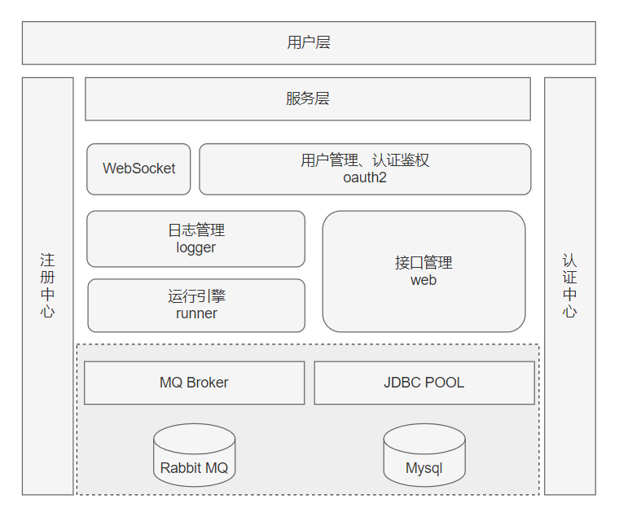

### 微服务应用

| 服务名          | 默认端口 | 主要功能                             |
| --------------- | -------- | ------------------------------------ |
| flow-eda-oauth2 | 8086     | 用户登录/注册、认证鉴权              |
| flow-eda-web    | 8081     | 后台管理，提供 API 接口，数据存储    |
| flow-eda-logger | 8082     | 日志管理，负责日志采集、存储、查询等 |
| flow-eda-runner | 8088     | 运行引擎，负责运行流程，产生运行日志 |
| flow-eda-vue    | 8080     | 前端 vue 项目，提供前端页面          |
| flow-eda-react  | 8000     | 前端 react 项目，提供前端页面        |

### 系统架构图

### 交互流程图

### 后端技术栈

| 技术            | 版本     | 说明                 |
| --------------- | -------- | -------------------- |
| Docker          | 20.10.14 | 应用容器引擎         |
| Docker Compose  | 2.5.0    | 应用容器部署工具     |
| Spring Boot     | 2.6.4    | 微服务框架           |
| Mybatis         | 3.5.9    | ORM 框架             |
| Mysql           | 8.0.28   | 数据库               |
| Maven           | 3.6.3    | 项目构建管理工具     |
| PageHelper      | 5.3.0    | MyBatis 物理分页插件 |
| Lombok          | 1.18.22  | 代码插件             |
| Nacos           | 2.0.4    | 服务注册中心         |
| Dubbo           | 3.0.7    | 服务远程调用         |
| WebSocket       | 9.0.58   | 数据推送             |
| RabbitMQ        | 3.9.15   | 消息队列             |
| Spring Security | 5.6.2    | 认证和授权框架       |
| Security Oauth2 | 2.3.6    | 认证和授权框架       |
| Guava           | 31.0.1   | 限流组件             |

### 前端 Vue 技术栈

| 技术            | 版本          | 说明                          |
| --------------- | ------------- | ----------------------------- |
| vue             | 3.1.2         | MVVM 的渐进式 JavaScript 框架 |
| vuex            | 4.0.2         | 状态管理框架                  |
| vue-router      | 4.0.10        | 路由管理工具                  |
| element-plus    | 1.0.2-beta.52 | 前端组件库                    |
| jsplumb         | 2.15.6        | 绘图组件                      |
| vue-json-viewer | 3.0.4         | json 编辑器                   |

### 前端 React 技术栈

| 技术            | 版本   | 说明                  |
| --------------- | ------ | --------------------- |
| react           | 17.0.0 | JavaScript 库         |
| Ant Design Pro  | v5     | 中台前端/设计解决方案 |
| umi             | 3.5.0  | react 应用框架        |
| jsplumb         | 2.15.6 | 绘图组件              |
| react-json-view | 1.21.3 | json 编辑器           |
